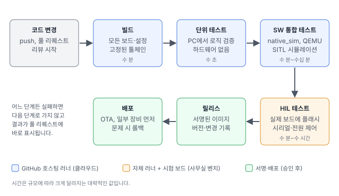
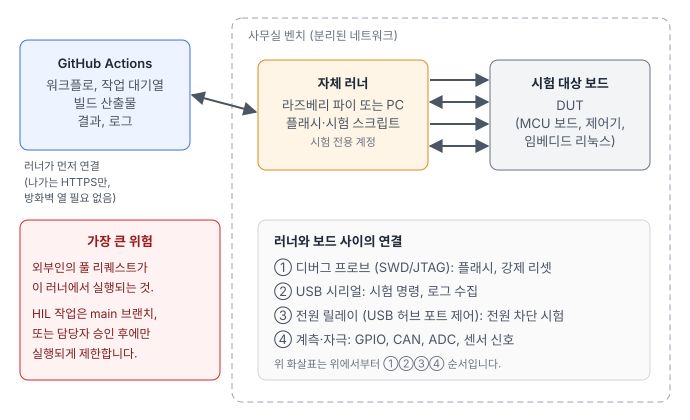

임베디드 개발팀에서 자주 듣는 말이 있습니다. "펌웨어는 보드가 있어야 시험할 수 있으니, CI/CD는 웹 서비스 이야기다."

실제로는 반대에 가깝습니다. 펌웨어 시험의 상당 부분은 보드 없이 자동으로 돌릴 수 있고, 나머지도 보드 한 장과 작은 컴퓨터 한 대면 자동화할 수 있습니다. 그리고 펌웨어는 한 번 장비에 들어가면 되돌리기 어렵기 때문에, 자동화의 효과가 웹 서비스보다 오히려 큽니다.

이번 글에서는 파이프라인을 직접 구축하지 않고, **GitHub Actions를 기준으로 임베디드 CI/CD의 구조, 단계별 역할, 장단점, 도입 순서**를 정리합니다. 예시는 이 블로그의 이전 프로젝트에서 가져왔습니다.

## CI와 CD, 펌웨어에서는 무엇을 뜻하나

- **CI(지속적 통합)**: 코드가 바뀔 때마다 자동으로 빌드하고 시험해서, 결과를 풀 리퀘스트(PR)에 바로 보여 주는 것입니다. 병합하기 전에 문제를 찾는 것이 목적입니다.
- **CD(지속적 전달·배포)**: 시험을 통과한 빌드를 언제든 내보낼 수 있는 상태(버전, 서명, 변경 기록)로 만들고, 필요하면 장비까지 보내는 것(OTA)입니다.

펌웨어에는 웹 서비스와 다른 점이 몇 가지 있습니다.

- 같은 코드를 **여러 보드와 설정**으로 빌드합니다.
- **툴체인 버전**이 바뀌면 결과물이 달라질 수 있습니다.
- 일부 시험은 **실제 하드웨어**가 있어야 합니다.
- 배포된 장비는 서버처럼 바로 되돌릴 수 없어서, **배포 전 검증과 롤백 수단**이 더 중요합니다.

## 전체 파이프라인



파란색 단계는 GitHub가 제공하는 클라우드 러너(작업을 실행하는 가상 머신)에서, 주황색 HIL 단계는 사무실에 둔 **자체 러너(self-hosted runner)**와 시험 보드에서, 초록색 릴리스와 배포는 담당자 승인 뒤에 실행합니다. 앞 단계일수록 빠르고 싸며, 뒤로 갈수록 느리지만 실제에 가깝습니다. 어느 단계든 실패하면 거기서 멈추고 결과가 PR에 표시됩니다.

## 단계별로 보기

### 1. 빌드: 누구의 PC에서 해도 같은 결과

빌드 단계의 목표는 "제 PC에서는 됐는데요"를 없애는 것입니다.

- **툴체인과 의존성 버전을 고정**합니다. Zephyr라면 west manifest에 Zephyr 버전을, Yocto라면 kas 파일에 각 레이어의 커밋을 적어 둡니다. 컨테이너 이미지로 빌드 환경 전체를 고정하는 방법도 있습니다.
- 지원하는 **모든 보드와 빌드 옵션을 매트릭스로** 빌드합니다. 한 보드에서만 확인하고 병합했다가 다른 보드 빌드가 깨지는 일이 흔합니다.
- **경고를 오류로** 취급합니다. 펌웨어 버그의 상당수가 컴파일러 경고로 먼저 나타납니다.
- 바이너리 크기와 맵 파일을 산출물로 남기면, **플래시·RAM 사용량이 언제 얼마나 늘었는지** 추적할 수 있습니다. 부트로더와 이미지 슬롯을 나눠 쓰는 MCU에서는 이것만으로도 사고를 여러 번 막습니다.

### 2. 단위 테스트: 로직은 PC에서

하드웨어와 상관없는 로직, 예를 들어 센서 값 변환, 필터, 상태 머신, 프로토콜 파싱은 PC에서 수 초 만에 시험할 수 있습니다. 조건은 하나입니다. **하드웨어 접근을 얇은 층으로 분리하고, 판단 로직은 순수한 C 함수로 두는 것**입니다.

[STM32F3 나침반 프로젝트](/posts/2026-09-stm32f3-zephyr-compass/)의 기울기 보정 방위각 계산과 캘리브레이션 판정이 이런 구조였고, 공개 저장소에는 다음과 같은 GitHub Actions 워크플로가 들어 있습니다. 호스트 단위 테스트와 펌웨어 빌드를 매 push와 PR마다 실행합니다.

```yaml
name: CI

on:
  push:
  pull_request:

jobs:
  host-tests:
    runs-on: ubuntu-24.04
    steps:
      - uses: actions/checkout@v4
      - name: Build and run host tests
        run: |
          cmake -S tests/host -B build/host
          cmake --build build/host
          ctest --test-dir build/host --output-on-failure

  firmware:
    runs-on: ubuntu-24.04
    steps:
      - uses: actions/checkout@v4
        with:
          path: stm32f3-zephyr-compass
      - uses: zephyrproject-rtos/action-zephyr-setup@v1
        with:
          app-path: stm32f3-zephyr-compass
          toolchains: arm-zephyr-eabi
      - name: Build firmware
        run: west build -b stm32f3_disco@E -d build/compass stm32f3-zephyr-compass/app
```

### 3. SW 통합 테스트: 부품을 합쳐서, 보드 없이

단위 테스트가 부품 하나를 본다면, 통합 테스트는 **펌웨어 전체와 주변 시스템이 맞물려 동작하는지**를 봅니다. 보드 없이 하는 방법은 여러 가지입니다.

- Zephyr의 `native_sim`(PC에서 실행되는 Zephyr 보드)이나 QEMU로 펌웨어 전체를 실행하고, Zephyr의 시험 도구 twister로 결과를 모읍니다.
- 통신 상대(센서, 상위 제어기, 지상국)를 시뮬레이터로 만듭니다.
- 비행체나 로봇이라면 SITL(Software In The Loop) 시뮬레이션에 펌웨어를 연결합니다.

[드론 비행 종료 시스템(FTS) 프로젝트](/posts/2026-09-fts-sim/)가 이 방식이었습니다. Zephyr 펌웨어를 `native_sim`으로, 드론은 PX4 SITL과 Gazebo로, 지상국은 ROS 2로 돌려서 열 가지 고장·오경보 시나리오를 자동으로 시험했습니다. 이런 시험은 한 번에 수십 분이 걸리고 GPU나 큰 메모리가 필요할 수 있어서, 매 PR보다는 **매일 밤(nightly)이나 main 병합 시**에 돌리는 경우가 많습니다.

한계도 분명합니다. 시뮬레이션은 실제 타이밍, 인터럽트 경합, 전기적 잡음, 센서의 개체 차이를 재현하지 못합니다. 그래서 다음 단계가 필요합니다.

### 4. HIL 테스트: 실제 보드에서

HIL(Hardware In the Loop) 테스트는 **빌드된 펌웨어를 실제 보드에 올려서** 시험하는 단계입니다. GitHub Actions에서는 사무실에 둔 컴퓨터를 자체 러너로 등록해서 구성합니다.



- 러너 프로그램이 **GitHub 쪽으로 먼저 연결**해서 작업을 받아 가므로, 사내 방화벽에 들어오는 포트를 열 필요가 없습니다.
- 러너는 라즈베리 파이 정도로 충분합니다. 앞 단계의 빌드 산출물을 받아 **디버그 프로브로 플래시**하고, **USB 시리얼로 시험 명령을 보내고 로그를 모으고**, **USB 허브 포트 제어나 릴레이로 전원을 끊었다 켜서** 전원 차단 상황까지 시험합니다. 결과와 로그는 다시 GitHub에 산출물로 올립니다.
- 매 실행 전에 **전원 리셋과 알려진 이미지 재플래시**로 보드를 같은 상태에서 시작하게 해야 합니다. 그래야 실패가 코드 문제인지, 보드가 이상한 상태로 남아 있던 탓인지 구분할 수 있습니다.
- 보드 한 장에는 한 작업만 붙어야 하므로 동시 실행을 막고, 보드가 여러 장이면 러너에 라벨을 붙여 나눕니다.

워크플로로 쓰면 대략 다음 모양입니다. **설명용 예시**이고, `bench/` 아래 스크립트 이름은 가상입니다. 앞의 `firmware` 작업이 빌드 결과를 `firmware`라는 이름의 산출물로 올린다고 가정했습니다.

```yaml
  hil:
    needs: [firmware]
    if: github.event_name == 'push' && github.ref == 'refs/heads/main'
    runs-on: [self-hosted, stm32f3-bench]
    environment: hil-bench
    concurrency: stm32f3-bench
    steps:
      - uses: actions/download-artifact@v4
        with:
          name: firmware
      - run: bench/power-cycle.sh
      - run: openocd -f board/stm32f3discovery.cfg -c "program zephyr.elf verify reset exit"
      - run: python3 bench/run_tests.py --port /dev/ttyACM0 --junit results.xml
      - uses: actions/upload-artifact@v4
        if: always()
        with:
          name: hil-results
          path: results.xml
```

[이중화 제어기 프로젝트](/posts/2026-09-redundant-controller/)에서 라즈베리 파이 두 대와 STM32로 손으로 했던 전환 시험들이 HIL로 옮기기 좋은 예입니다. 한 번 스크립트로 만들어 두면, 코드가 바뀔 때마다 같은 시험을 사람 손 없이 반복할 수 있습니다.

### 자체 러너의 가장 큰 위험

GitHub 문서도 **공개 저장소에는 자체 러너를 쓰지 말라**고 권합니다. 누구나 PR을 올릴 수 있고, 그 PR의 워크플로가 여러분의 사무실 컴퓨터에서 실행될 수 있기 때문입니다. 러너가 사내망에 있다면 그 컴퓨터를 통해 사내망까지 닿을 수 있습니다.

대책은 다음과 같습니다.

- 가능하면 **비공개 저장소**에서만 자체 러너를 씁니다.
- 공개 저장소라면 HIL 작업은 **main 브랜치 push나 수동 실행**에서만 돌게 하고, GitHub의 environment에 **승인자**를 지정해 사람이 확인한 뒤에만 실행되게 합니다. 외부 기여자의 워크플로는 승인 후 실행되도록 저장소 설정도 확인합니다.
- 러너는 **시험 전용 계정과 분리된 네트워크**에 두고, 러너에 비밀 값(서명 키, 서버 비밀번호)을 두지 않습니다.
- 가능하면 작업 하나마다 깨끗한 환경에서 시작하는 **임시(ephemeral) 러너**로 운영합니다.

### 5. 릴리스와 배포

시험을 모두 통과한 커밋에 버전 태그를 붙이면, 릴리스 작업이 이어집니다.

- 릴리스용으로 다시 빌드하고, **이미지에 서명**합니다. MCU라면 MCUboot의 `imgtool`, 임베디드 리눅스라면 RAUC나 SWUpdate 번들 서명이 대표적입니다.
- GitHub Release에 이미지, 변경 기록, 그리고 **SBOM**(소프트웨어 구성 목록)을 함께 올립니다. Yocto는 빌드할 때 SPDX 형식의 SBOM을 만들어 줍니다.
- **서명 키는 CI에 그냥 두지 않습니다.** 서명은 별도 단계로 분리하고, 키는 HSM이나 클라우드 KMS에 두며, 사람의 승인 뒤에만 서명되게 합니다. CI가 뚫려도 서명된 악성 펌웨어가 나가지 않게 하려는 것입니다.
- 배포는 **일부 장비부터** 시작합니다. 새 이미지가 스스로 정상 동작을 확인하지 못하면 이전 이미지로 돌아가는 **자동 롤백**이 장비 쪽에 있어야 안심하고 배포를 자동화할 수 있습니다. MCU의 서명 부팅과 롤백, 임베디드 리눅스의 A/B 업데이트는 이어지는 글에서 직접 만들어 볼 예정입니다.

어떤 커밋이 어떤 바이너리가 되었고, 그 바이너리가 어떤 시험을 통과해 어떤 장비에 들어갔는지가 한 줄로 이어지는 것, 이것이 CD의 가장 큰 가치입니다.

## 장점과 비용

| 장점 | 비용과 단점 |
|---|---|
| 문제를 **병합 전에** 찾습니다. 현장이나 고객사에서 찾는 것보다 훨씬 쌉니다. | **처음 구축하는 시간**이 듭니다. 특히 HIL 벤치(지그, 케이블, 전원 제어)는 하드웨어 작업입니다. |
| **재현 가능한 빌드**로 "제 PC에서는 됩니다"가 사라집니다. | **유지보수**가 필요합니다. 툴체인 업데이트, 러너 관리, 벤치 하드웨어 고장. |
| 리뷰어가 빌드·시험 결과를 보고 **로직에 집중**할 수 있습니다. | **불안정한 시험**(가끔 실패하는 시험)이 쌓이면 모두가 결과를 무시하게 됩니다. 바로 고치거나 격리해야 합니다. |
| 보드가 몇 장뿐이어도 **여러 사람이 벤치를 공유**합니다. | 비공개 저장소는 러너 사용 시간에 따라 **요금**이 생길 수 있고, 무거운 시뮬레이션은 비쌉니다. |
| 릴리스가 큰 행사가 아니라 **버튼 한 번**이 되고, 커밋·바이너리·장비가 추적됩니다. | 자체 러너와 서명 키는 **새로운 보안 위험**입니다. 위의 대책이 필요합니다. |
| 시험 기록이 남아 **고객 대응과 인증**에 근거가 됩니다. 기능 안전 표준이 요구하는 추적성 자료를 만드는 데도 도움이 됩니다. | 시뮬레이션과 HIL도 **현장 조건 전부를 재현하지는 못합니다.** 현장 시험을 대신하지 않습니다. |

## 어디서부터 시작할까

한 번에 전부 만들 필요는 없습니다. 효과가 크고 비용이 작은 순서로 권하면 다음과 같습니다.

1. **빌드만 자동화**합니다. 모든 보드를 매 PR마다 빌드하는 것만으로도 깨진 병합이 크게 줄어듭니다. 보통 하루 안에 됩니다.
2. **호스트 단위 테스트**를 붙입니다. 새로 짜거나 고치는 로직부터 하드웨어와 분리하면서 조금씩 늘립니다.
3. **태그를 붙이면 릴리스 산출물이 자동으로 올라가게** 합니다. 누가 어떤 바이너리를 내보냈는지가 분명해집니다.
4. **시뮬레이션 통합 테스트**를 nightly로 돌립니다.
5. **HIL 벤치 한 대**를 만듭니다. 가장 자주 깨지거나 손으로 시험하기 가장 귀찮은 기능부터 시작합니다.
6. **서명과 OTA 배포**를 파이프라인에 연결합니다. 장비 쪽 롤백이 먼저 준비되어 있어야 합니다.

## 마무리

임베디드에서 CI/CD의 핵심은 도구가 아니라 구조입니다. 판단 로직을 하드웨어와 분리해 PC에서 시험할 수 있게 만들고, 하드웨어가 꼭 필요한 시험만 벤치로 보내고, 서명과 롤백으로 배포를 안전하게 만드는 것입니다. GitHub Actions는 그 구조를 적은 비용으로 올려놓을 수 있는 좋은 출발점입니다.

펌웨어 빌드·시험 자동화, HIL 벤치 구축, 서명과 OTA를 포함한 배포 파이프라인이 필요하시면 언제든 연락 주세요.
