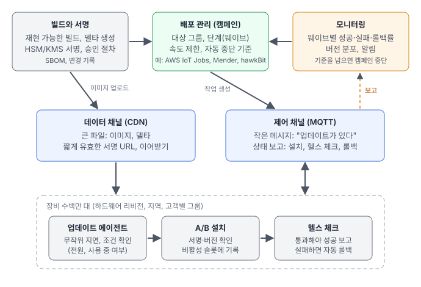
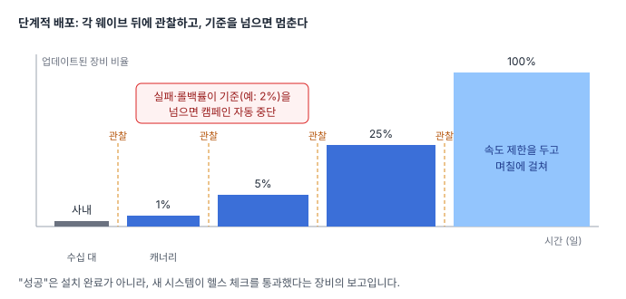

[지난 글](/posts/2026-09-pi5-ab-update/)에서는 라즈베리 파이 5 한 대에 서명된 A/B 업데이트와 자동 롤백을 만들었습니다. 새 시스템이 스스로 정상임을 증명하지 못하면 이전 시스템으로 돌아가고, 변조된 업데이트는 쓰기 전에 거부합니다.

그런데 장비가 한 대가 아니라 **수백만 대**라면 어떨까요? 장비 한 대를 안전하게 만드는 일은 여전히 기반이지만, 그 위에서 전혀 다른 종류의 문제가 생깁니다. 백만 대 중 1%만 실패해도 만 대이고, 사람이 가서 고칠 수 있는 수가 아닙니다.

이번 글은 구현 없이 **설계 관점**에서, 대규모 OTA(Over-The-Air) 업데이트에서 부딪히는 어려운 점과 실제 현장에서 쓰이는 해결 방법을 정리합니다.

## 전체 구조

핵심은 다섯 부분입니다.

- **빌드와 서명**: 재현 가능한 빌드, 델타 파일 생성, 안전하게 보관된 키로 서명.
- **배포 관리(캠페인)**: 어떤 장비 그룹에, 어떤 순서와 속도로, 어떤 조건에서 멈출지 정합니다.
- **제어 채널**: "업데이트가 있다"는 작은 알림과 장비의 상태 보고가 오가는 길. 보통 MQTT입니다.
- **데이터 채널**: 수십~수백 MB의 이미지가 내려가는 길. CDN을 씁니다.
- **장비**: 업데이트 에이전트, A/B 설치, 헬스 체크와 자동 롤백. 지난 글에서 만든 부분입니다.

아래에서 어려운 점을 하나씩 보겠습니다.

## 어려운 점 1: 연결 수와 한꺼번에 몰리는 다운로드

**문제.** 백만 대가 서버에 계속 연결되어 있어야 하고, 업데이트를 알리는 순간 모두가 동시에 받으려고 하면 서버와 네트워크가 버티지 못합니다. 계산해 보면 60 MB 이미지 × 100만 대는 약 **60 TB**입니다. 이것을 한 시간 안에 내려보내려면 평균 약 **133 Gbps**가 필요하지만, 일주일에 걸쳐 나누면 1 Gbps 미만입니다.

**해결.**

- **제어와 데이터를 분리합니다.** 알림은 수백 바이트짜리 MQTT 메시지로 보내고, 큰 파일은 CDN에서 받게 합니다. AWS IoT Core 같은 관리형 MQTT 서비스는 수백만 개의 동시 연결을 전제로 만들어져 있고, CDN은 대용량 배포에 최적화되어 있습니다. 애플리케이션 서버가 파일을 직접 내려주는 구조는 규모가 커지면 가장 먼저 무너집니다.
- **무작위 지연**(jitter)을 넣습니다. 알림을 받은 장비가 0~몇 시간 사이의 무작위 시점에 다운로드를 시작하게 하면 부하가 고르게 퍼집니다.
- **속도 제한과 작업 창**을 둡니다. 분당 시작할 수 있는 장비 수를 제한하고, 설치와 재부팅은 장비 현지 시각 기준의 유지보수 시간대에만 하게 합니다.
- **짧게 유효한 서명 URL**을 씁니다. 다운로드 링크가 유출되어도 몇 분 뒤에는 쓸 수 없고, CDN 캐시는 그대로 활용됩니다.

## 어려운 점 2: 잘못된 릴리스가 한꺼번에 퍼지는 것

**문제.** 사내 시험을 모두 통과해도, 현장에는 시험하지 못한 하드웨어 리비전, 설정, 환경이 반드시 있습니다. 모든 장비에 동시에 배포하면 문제를 발견했을 때는 이미 전부 퍼진 뒤입니다.

**해결.**

- **단계적 배포(웨이브)**: 사내 장비 → 1%(캐너리) → 5% → 25% → 100% 식으로 넓히고, 각 단계 뒤에 일정 시간 관찰합니다. 첫 웨이브는 하드웨어 리비전, 지역, 고객을 골고루 섞어서 뽑아야 대표성이 있습니다.
- **자동 중단 기준**: 실패율, 롤백률, 타임아웃 비율이 기준(예: 2%)을 넘으면 캠페인을 자동으로 멈춥니다. AWS IoT Jobs에는 배포 속도(rollout), 중단 기준(abort), 타임아웃 설정이 기본으로 있습니다.
- **"성공"의 정의를 바꿉니다.** 설치가 끝났다는 보고가 아니라, **새 시스템이 헬스 체크를 통과했다**는 보고만 성공으로 칩니다. 지난 글의 구조에서는 헬스 체크를 통과해야 RAUC가 슬롯을 good으로 표시하므로, 이 시점에 성공을 보고하면 됩니다. 그래야 "설치는 됐는데 부팅 후 기능이 죽는" 릴리스가 첫 웨이브에서 멈춥니다.
- **멈춘 뒤에는 되돌리기보다 고쳐서 앞으로 갑니다.** 이미 새 버전을 정상으로 받아들인 장비는 자동 롤백 대상이 아닙니다. 다운그레이드 방지(아래 보안 참고)와도 충돌하므로, 보통은 문제를 고친 새 버전을 다시 단계적으로 배포합니다(roll forward).

## 어려운 점 3: 대역폭과 비용

**문제.** 셀룰러로 연결된 장비는 데이터 요금이 비싸고, 60 TB를 CDN으로 내보내는 것도 릴리스마다 적지 않은 비용입니다. 대략 기가바이트당 수 센트로 잡으면 한 번에 수천 달러 규모가 됩니다.

**해결.**

- **델타 업데이트**: 바뀐 블록만 보냅니다. RAUC의 adaptive update나 casync, Mender의 델타 업데이트, MCU라면 bsdiff 같은 방법이 있고, 변경이 적은 릴리스는 크기가 몇 분의 일에서 수십 분의 일로 줄어듭니다. 다만 장비마다 기준 버전이 달라서 델타를 여러 벌 만들어야 하고, 델타를 적용할 수 없을 때를 대비해 전체 이미지 경로도 남겨 둬야 합니다.
- **스트리밍 설치**: 파일을 저장하지 않고 받으면서 바로 설치합니다. 저장 공간이 작은 장비에 특히 유용하고, RAUC는 HTTP 스트리밍 설치를 지원합니다.
- **사이트 캐시**: 공장이나 매장처럼 장비가 모여 있는 곳에는 게이트웨이가 한 번만 받아서 나눠 줍니다.
- **네트워크 조건**: 셀룰러에서는 작은 보안 업데이트만, 큰 기능 업데이트는 Wi-Fi나 유선에서만 받게 하는 식으로 정책을 나눕니다.

## 어려운 점 4: 불안정한 네트워크와 전원

**문제.** 현장 장비는 연결이 자주 끊기고, 배터리가 부족하거나, 사용 중일 때가 많습니다. 다운로드가 90%에서 끊기거나, 설치 중에 전원이 나가는 일은 예외가 아니라 일상입니다.

**해결.**

- **이어받기**: HTTP Range 요청으로 끊긴 지점부터 다시 받습니다.
- **설치 조건 확인**: 배터리 잔량, 전원 연결 여부, 장비가 작업 중인지를 확인한 뒤에만 설치합니다. 차량이나 의료 장비라면 이 조건이 안전 요구사항이 됩니다.
- **설치와 재부팅의 분리**: 백그라운드에서 비활성 슬롯에 설치해 두고, 재부팅은 유휴 시간이나 사용자가 허락했을 때 합니다. A/B 구조는 설치 중 전원이 나가도 실행 중인 슬롯이 그대로라 이 방식과 잘 맞습니다.
- **타임아웃과 재시도 정책**: 장비가 몇 시간, 며칠 동안 응답하지 않는 것을 정상으로 보고, 캠페인의 타임아웃과 재시도 횟수를 그에 맞게 정합니다.

## 어려운 점 5: 보안

**문제.** OTA는 모든 장비에 코드를 넣을 수 있는 통로입니다. 공격자가 이 통로를 얻으면 수백만 대를 한 번에 장악할 수 있으므로, 대규모 OTA에서 가장 무거운 책임입니다.

**해결.**

- **장비별 신원**: 모든 장비가 고유한 인증서와 키를 가지고, 키는 보안 소자(secure element)나 TPM 같은 하드웨어에 둡니다. 공장에서 발급하고(프로비저닝), 도난·폐기된 장비는 개별로 차단합니다.
- **서명 키 관리**: 서명 키는 CI 서버가 아니라 HSM이나 클라우드 KMS에 두고, 릴리스 서명에는 여러 사람의 승인을 요구합니다. 키 교체(rotation)와 폐기(revocation) 절차를 처음부터 설계에 넣어야 합니다. 장비에 심어 둔 키를 나중에 바꿀 방법이 없으면, 키가 유출되는 순간 끝입니다.
- **다운그레이드 방지**: 알려진 취약점이 있는 옛 버전은 서명이 유효하더라도 설치되면 안 됩니다. 장비가 버전 카운터를 되돌릴 수 없는 곳(보안 소자, OTP)에 기록하고 그보다 낮은 버전은 거부합니다.
- **서버가 뚫려도 버티는 구조**: TUF(The Update Framework)와 자동차용 Uptane은 역할별로 키를 나누고 메타데이터에 만료 시간을 두어, 배포 서버 하나가 장악되어도 장비가 악성 업데이트나 오래된 업데이트를 받아들이지 않게 합니다.
- **부팅 체인 검증**: 업데이트 서명만으로는 부족하고, 부팅할 때 펌웨어부터 커널까지 검증하는 보안 부팅이 함께 있어야 합니다. 지난 글에서 의도적으로 뺀 부분이 바로 이것입니다.

## 어려운 점 6: 기기 다양성과 버전 파편화

**문제.** 몇 년 동안 팔린 장비에는 하드웨어 리비전이 여러 개이고, 몇 달씩 꺼져 있다가 켜지는 장비도 있습니다. 시간이 지나면 현장의 버전이 수십 가지로 흩어집니다.

**해결.**

- **호환성 표시**: 이미지마다 맞는 하드웨어를 명시하고(RAUC의 compatible 문자열 같은 방식), 장비가 맞지 않는 이미지를 거부하게 합니다.
- **업데이트 경로 관리**: 아주 오래된 버전에서 최신 버전으로 한 번에 갈 수 없는 경우(데이터 형식 변경, 부트로더 변경)가 있습니다. 이때는 중간 버전을 거치게 하는 경로(stepping stone)를 두고, 지원하는 최소 버전을 정합니다.
- **함께 업데이트되는 부품**: 리눅스 쪽과 MCU 펌웨어처럼 서로 맞아야 하는 부품은 하나의 검증된 묶음으로 배포하고, 순서(예: MCU 먼저, 확인 후 리눅스)를 정합니다.
- **지원 버전 수 줄이기**: 현장에 남은 버전 분포를 계속 보고, 오래된 버전을 줄여 가는 것 자체를 목표로 삼습니다. 버전 수가 곧 시험 비용입니다.

## 어려운 점 7: 가시성

**문제.** 수백만 대에서 무슨 일이 일어나는지 모르면, 자동 중단도 원인 분석도 할 수 없습니다.

**해결.**

- **장비 보고**: 현재 버전, 실행 중인 슬롯, 헬스 체크 결과, 롤백 횟수, 다운로드 시간을 보고하게 합니다. 전체 로그 대신 요약 지표와 일부 샘플만 올려 통신량을 줄입니다.
- **웨이브별 대시보드와 알림**: 웨이브마다 성공·실패·롤백률, 버전 분포, 하드웨어 리비전별 차이를 보고, 기준을 넘으면 알림을 보냅니다.
- **조용한 실패 찾기**: 롤백은 되었지만 사용자가 모르는 경우, 업데이트 후 배터리 소모나 오류율이 늘어난 경우처럼 성공/실패로 드러나지 않는 문제를 지표로 잡아야 합니다.

## 어려운 점 8: 규정과 운영

**문제.** 업데이트 기능은 점점 규제 대상이 되고 있습니다. 예를 들어 차량에는 소프트웨어 업데이트 관리 체계를 요구하는 UNECE R156이 있고, 유럽 연합의 사이버 복원력법(CRA)은 제품의 보안 업데이트 제공을 요구합니다.

**해결.** 어떤 소스가 어떤 바이너리가 되었고, 어떤 시험을 통과해 어느 장비에 언제 들어갔는지를 기록으로 남깁니다. SBOM(소프트웨어 구성 목록)과 릴리스 승인 기록, 배포 이력이 곧 규정 대응 자료입니다. [CI/CD 글](/posts/2026-09-embedded-ci-cd/)에서 다룬 추적성이 여기서 다시 중요해집니다.

## 직접 만들까, 플랫폼을 쓸까

대부분의 팀은 모든 것을 직접 만들지 않습니다.

| 방법 | 잘 맞는 경우 | 주의할 점 |
|---|---|---|
| AWS IoT Jobs + S3 + CloudFront | 이미 AWS를 쓰고, 장비 쪽 에이전트를 직접 만들 수 있을 때 | 단계적 배포와 중단 기능은 있지만, 델타·장비 쪽 로직은 직접 구현 |
| Azure Device Update | Azure IoT를 쓰는 경우 | 장비 쪽 에이전트와 업데이트 방식의 궁합 확인 |
| Mender | 임베디드 리눅스, 빠르게 시작하고 싶을 때 | 고급 기능(델타, 대규모 관리)은 상용 버전 |
| Eclipse hawkBit + RAUC | 오픈 소스로 직접 운영하고 싶을 때 | 서버 운영과 확장을 직접 책임 |
| Uptane 기반 솔루션 | 자동차처럼 보안 요구가 높을 때 | 구조가 복잡하고 도입 비용이 큼 |

어느 쪽을 고르든 **장비 쪽의 안전장치**(A/B, 서명 검증, 헬스 체크, 자동 롤백)는 제품 팀의 몫으로 남습니다. 서버는 "언제, 누구에게"를 정할 뿐이고, "실패해도 망가지지 않는 것"은 장비가 보장해야 합니다.

## 도입 순서

한 번에 전부 만들 필요는 없습니다. 위험이 큰 것부터 막는 순서를 권합니다.

1. **장비 쪽 안전장치**: A/B 설치, 서명 검증, 헬스 체크와 자동 롤백. 이것 없이 규모를 키우면 안 됩니다.
2. **장비별 신원과 서명 키 관리**: 공장 프로비저닝, HSM/KMS, 승인 절차.
3. **단계적 배포와 자동 중단**, 그리고 헬스 체크 기준의 성공 보고.
4. **가시성**: 버전 분포, 웨이브별 지표, 알림.
5. **대역폭 최적화**: 델타, 스트리밍 설치, 사이트 캐시.
6. **고급 보안**: 다운그레이드 방지 카운터, 키 교체, TUF/Uptane, 보안 부팅.

## 마무리

대규모 OTA의 어려움은 대부분 "평균적인 장비"가 아니라 **끊기고, 꺼지고, 오래되고, 다른 장비들**에서 나옵니다. 그래서 설계의 중심은 두 가지입니다. 장비 한 대가 어떤 상황에서도 망가지지 않게 하는 것, 그리고 잘못된 릴리스가 퍼지기 전에 **작은 범위에서 자동으로 멈추는 것**입니다.

다음 글에서는 이 설계 중 일부를 작은 규모로 직접 만들어 볼 예정입니다. AWS IoT로 라즈베리 파이와 STM32에 Wi-Fi OTA를 배포하고, 단계적 배포와 자동 중단이 실제로 어떻게 동작하는지 보겠습니다.

대규모 장비의 OTA 설계, 임베디드 리눅스와 MCU의 안전한 업데이트 구조가 필요하시면 언제든 연락 주세요.
