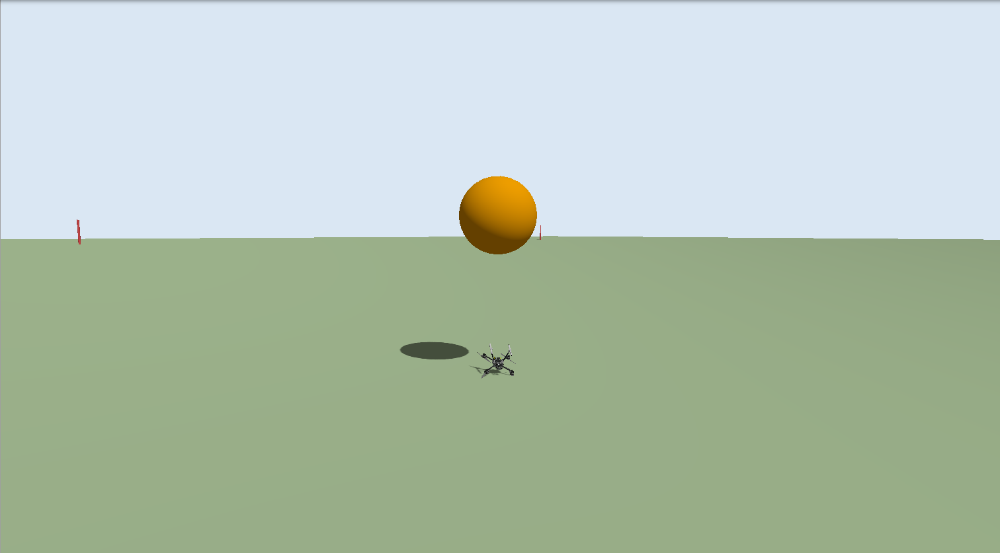
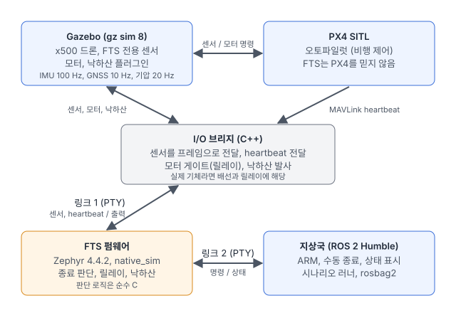
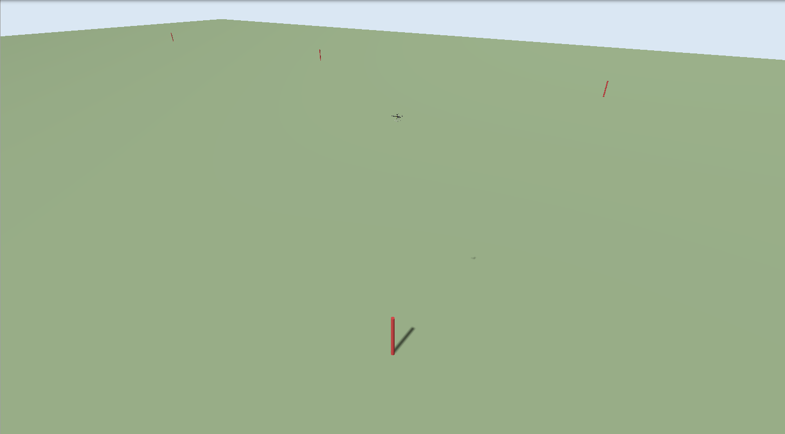
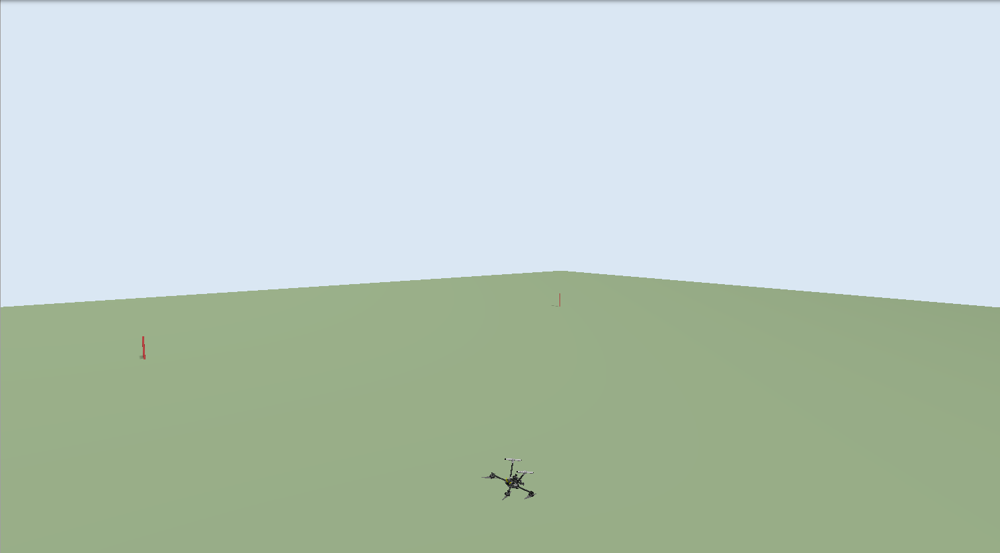
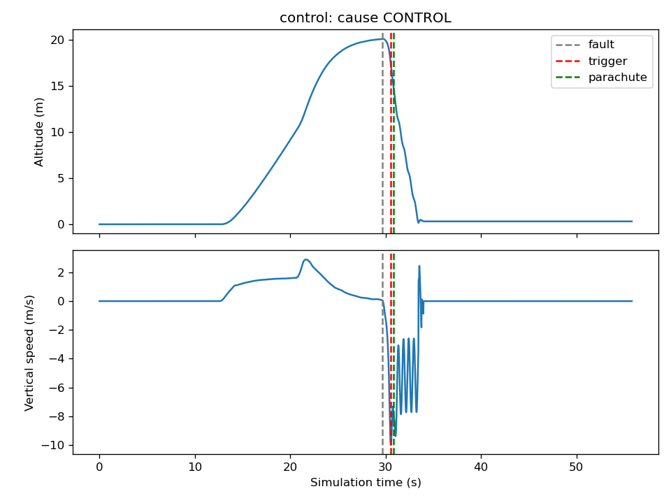
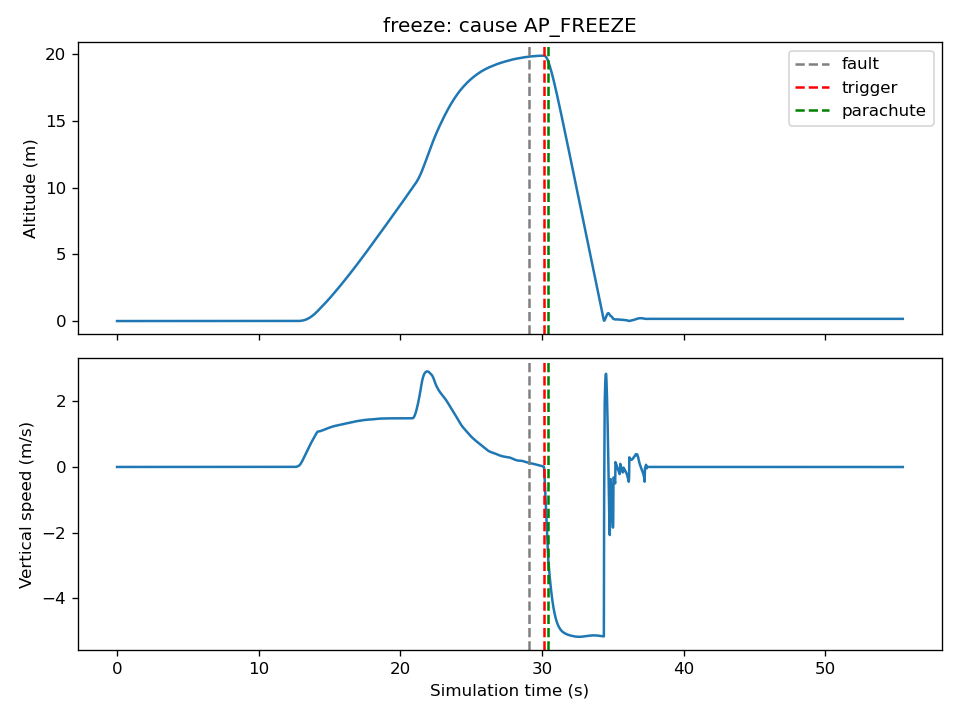

드론이 정해진 구역을 벗어나거나, 제어를 잃거나, 오토파일럿이 멈췄을 때 비행을 강제로 끝내는 장치를 **비행 종료 시스템(FTS, Flight Termination System)**이라고 합니다. 모터 전원을 끊고 낙하산을 펴서, 사고가 나더라도 정해진 구역 안에서 느리게 떨어지게 하는 것이 목적입니다. 소형 드론용 낙하산에는 ASTM F3322 같은 공개 표준이 있고, 사람 위나 가시권 밖 비행을 승인받을 때 이런 장치를 요구하거나 권장하는 경우가 있습니다.

이번 글에서는 FTS를 **하드웨어 없이** 만들고 시험했습니다.

- FTS: Zephyr 4.4.2 펌웨어, `native_sim` (PC에서 실행되는 Zephyr 보드)
- 드론: PX4 SITL이 조종하는 x500 쿼드콥터, Gazebo 8 시뮬레이션
- 지상국과 시험 자동화: ROS 2 Humble

결론부터 말하면, 일곱 가지 고장 상황에서 모두 **올바른 원인으로 종료**했고, 릴레이는 판단 즉시, 낙하산은 0.3초 뒤에 동작했으며, 모두 초속 약 5 m로 내려와 착지했습니다. 종료하면 안 되는 세 가지 상황에서는 한 번도 종료하지 않았습니다.



## 구성



| 역할 | 구현 |
|---|---|
| FTS | Zephyr 펌웨어 (`native_sim`), 판단 로직은 순수 C |
| 기체, 센서, 모터, 낙하산 | Gazebo 8, x500 모델 복사본 + 낙하산 플러그인(C++) |
| 오토파일럿 | PX4 v1.15.4 SITL |
| 배선과 릴레이 | I/O 브리지 (C++, Gazebo transport) |
| 지상국, 시나리오 실행 | ROS 2 Humble (Python) |

FTS와 바깥 세계는 시리얼 링크 두 개로만 연결됩니다. 링크 1로 센서 값과 오토파일럿 heartbeat가 들어오고 릴레이·낙하산 명령이 나갑니다. 링크 2는 지상국 무선 링크 역할입니다. 둘 다 PTY(가상 시리얼)이고, 프레임 형식은 CRC-16이 붙은 작은 바이너리 프레임입니다. 실제 기체로 옮기면 브리지와 Gazebo가 빠지고 그 자리에 UART, 센서, 릴레이가 들어갑니다.

## 가장 중요한 원칙: FTS는 오토파일럿을 믿지 않는다

FTS가 필요한 순간은 대개 오토파일럿이 잘못된 순간입니다. 오토파일럿의 위치 추정이 틀렸거나, 소프트웨어가 멈췄거나, 설정이 잘못된 경우입니다. 그래서 FTS가 오토파일럿의 판단에 기대면 의미가 없습니다.

- **자체 센서.** FTS는 PX4와 별도의 IMU, GNSS, 기압계를 씁니다. 모델에 FTS 전용 센서 보드를 따로 달았습니다.
- **오토파일럿은 밖에서만 본다.** PX4에서 받는 것은 살아 있다는 신호(MAVLink heartbeat, 10 Hz)뿐입니다. PX4의 위치나 상태는 읽지 않습니다.
- **출력은 오토파일럿보다 아래에.** 모터 명령은 PX4에서 나와 릴레이(브리지의 게이트)를 거쳐 모터로 갑니다. 릴레이가 열리면 PX4가 무엇을 명령하든 모터는 멈춥니다.
- **FTS 경로에 ROS 2는 없다.** ROS 2는 지상국과 시험 자동화에만 씁니다.

## 종료 조건

종료 판단은 FTS가 **ARMED** 상태일 때만 합니다. 지상에서 다루는 동안(SAFE)에는 무슨 일이 있어도 종료하지 않고, 지상국의 ARM 명령은 GNSS 고정이 있고 기체가 구역 안에 있을 때만 받아들입니다. 한 번 종료하면 재시작 전까지 풀리지 않습니다.

| 조건 | 판단 근거 | 기준 |
|---|---|---|
| 지오펜스 이탈 | FTS GNSS | 구역 밖에 0.5초 넘게 있음 |
| 고도 상한 | FTS 기압계, GNSS | 상한 위에 0.5초 넘게 있음 |
| 제어 상실 | FTS IMU | 기울기 60° 또는 회전 300°/s 초과가 0.5초 넘게 |
| 오토파일럿 정지 | heartbeat (10 Hz) | 1.0초 넘게 없음 |
| 지상국 링크 상실 | 링크 2 | 5초 넘게 올바른 프레임 없음 |
| GNSS 고정 상실 | FTS GNSS | 3D 고정이 1.0초 넘게 없음 |
| 수동 종료 | 링크 2 | `TERMINATE_ARM` 후 3초 안에 `TERMINATE` |

대부분의 조건에 **확인 시간**을 둔 것은 오경보 때문입니다. GNSS 한 샘플이 튀거나 heartbeat 하나가 늦게 온다고 비행을 끝내면, FTS 자체가 사고 원인이 됩니다. 반대로 확인 시간이 길면 종료가 늦어집니다. 이 균형이 뒤에서 볼 "펜스 밖 22 m"로 이어집니다.

종료 순서는 **릴레이를 먼저 열고, 0.3초 뒤에 낙하산**입니다. 프로펠러가 돌고 있을 때 낙하산을 펴면 줄이 감길 수 있어서, 회전이 줄어들 시간을 둡니다.

## 소프트웨어 구조와 테스트

판단 로직은 하드웨어에 의존하지 않는 순수 C 모듈이고, 호스트에서 먼저 테스트했습니다(TDD). 펌웨어는 시리얼 링크에서 프레임을 받아 이 로직에 넘기는 얇은 층입니다.

- `common/`: 프레임 인코딩, CRC-16, 스트리밍 파서. FTS, 브리지, 지상국(Python 구현)이 같은 형식을 씁니다.
- `fts/src/logic/`: 상태 머신과 종료 조건(`fts.c`), 지오펜스 다각형 판정(`geo.c`), 자체 점검(`pbit.c`), 링크 처리(`app.c`)

모든 시간은 **시뮬레이션 시간**입니다. 센서 프레임마다 Gazebo 시간이 붙어 오고, FTS는 IMU 프레임(100 Hz)이 올 때마다 조건을 검사합니다. 그래서 PC가 느려 시뮬레이션이 실시간보다 늦게 돌아도 측정값은 흔들리지 않습니다.

종료 판단 부분은 이렇습니다. 조건마다 "얼마나 오래 계속되었는가"를 따로 추적하고, 확인 시간을 넘으면 종료합니다.

```c
if (hold_confirmed(&s->hold_fence, s->cfg.fence_confirm_us)) {
	terminate(s, FTS_CAUSE_FENCE, t_us);
} else if (hold_confirmed(&s->hold_ceiling, s->cfg.fence_confirm_us)) {
	terminate(s, FTS_CAUSE_CEILING, t_us);
} else if (hold_confirmed(&s->hold_control, s->cfg.control_confirm_us)) {
	terminate(s, FTS_CAUSE_CONTROL, t_us);
} else if (!recent(s->t_heartbeat_us, t_us, s->cfg.heartbeat_timeout_us)) {
	terminate(s, FTS_CAUSE_AP_FREEZE, t_us);
} else if (!recent(s->t_link_us, t_us, s->cfg.link_timeout_us)) {
	terminate(s, FTS_CAUSE_LINK, t_us);
} else if (!recent(s->t_fix_us, t_us, s->cfg.sensor_timeout_us)) {
	terminate(s, FTS_CAUSE_GNSS_LOST, t_us);
}
```

전원을 켜면 1초 동안 **자체 점검(PBIT)**을 합니다. 센서 프레임이 기대한 주기로 오는지, 정지 상태의 가속도가 중력(약 9.8 m/s²)과 맞는지, 릴레이와 낙하산 출력의 되읽기 값이 정상인지, 지오펜스 설정이 올바른지 확인하고, 하나라도 틀리면 FAULT 상태가 되어 ARM을 받지 않습니다.

## 만들면서 만난 문제들

### 코드 리뷰에서 찾은 두 가지 종료 버그

로직을 다 만든 뒤 새 시각으로 리뷰해서 두 가지 심각한 문제를 찾았습니다. 둘 다 테스트는 모두 통과하던 상태였습니다.

- **시간이 조금만 뒤로 가도 즉시 종료.** heartbeat 시각이 현재 시각보다 미래로 찍혀 있으면 "최근 1초 안에 받았는가" 검사가 거짓이 되어, 오토파일럿 정지로 판단하고 종료했습니다. 시뮬레이션을 리셋하거나, heartbeat에 붙은 시각이 IMU보다 몇 ms 앞서기만 해도 일어납니다. 실제로 브리지는 heartbeat에 4 ms 단위의 시뮬레이션 시계를, IMU에는 10 ms 단위의 센서 시각을 붙이므로 매 비행마다 일어날 수 있는 상황이었습니다. 이제 시간이 뒤로 가면 타이머를 현재 시각에서 다시 시작합니다.
- **DISARM이 수동 종료를 숨김.** `TERMINATE`를 받으면 다음 검사 주기에 종료하도록 표시만 해 두었는데, 그 사이에 `DISARM`이 오면 표시가 남은 채 SAFE로 돌아갔습니다. 그리고 한참 뒤 다시 ARM하는 순간 종료되었습니다. 이제 `TERMINATE`는 받는 즉시 종료합니다.

두 문제 모두 먼저 실패하는 테스트를 만들고 고쳤습니다.

### GNSS를 잃으면 지오펜스 검사가 조용히 꺼졌다

같은 리뷰에서, FTS의 GNSS가 고정을 잃으면 지오펜스 검사가 **아무 알림 없이 멈춘다**는 점도 나왔습니다. 위치를 모르니 구역 밖인지 판단할 수 없는 것은 당연하지만, 그 상태로 계속 비행하게 두면 지오펜스가 없는 것과 같습니다. 그래서 "GNSS 고정 상실"을 종료 조건으로 추가했습니다(1.0초). IMU와 기압계의 고장은 이번 범위에서 제외했습니다.

### 고장을 넣었는데 들어가지 않은 시험

시나리오 러너는 브리지에 "heartbeat 5개 버리기" 같은 고장을 Gazebo 토픽으로 보냅니다. 한 번은 이 메시지가 전달되지 않았는데, 러너는 FTS가 종료하지 않았으니 **오경보 없음, 통과**로 기록했습니다. 고장을 넣지 않았으니 당연히 종료하지 않은 것입니다. 오경보 시험에서 이런 실수는 결과를 정반대로 만듭니다. 이제 러너는 브리지 로그에서 고장이 실제로 적용되었는지 확인하고, 없으면 다시 보내거나 시험을 실패로 처리합니다.

## 실험 결과

모든 비행은 지상에서 FTS를 ARM하고, PX4로 20 m까지 이륙해 3초 머문 뒤 시나리오를 시작했습니다. 지오펜스는 원점 기준 ±100 m 정사각형, 고도 상한은 40 m입니다. 낙하산은 항력 계수 1.5, 면적 0.85 m²(2 kg 기체에서 약 5 m/s)로 두고, 서쪽에서 3 m/s 바람이 낙하산에만 작용하게 했습니다.

| 시나리오 | 원인 | 고장부터 종료 판단까지 | 판단 시 고도 | 낙하산 하강 속도 | 착지까지 밀린 거리 |
|---|---|---|---|---|---|
| 지오펜스 (동쪽으로 8 m/s) | FENCE | 552 ms | 20.1 m | 5.1 m/s | 17.5 m |
| 고도 상한 (상승) | CEILING | 544 ms | 41.6 m | 5.1 m/s | 24.2 m |
| 모터 1개 정지 | CONTROL | 848 ms | 17.6 m | 5.1 m/s | 7.2 m |
| PX4 멈춤 (SIGSTOP) | AP_FREEZE | 1008 ms | 19.9 m | 4.9 m/s | 10.8 m |
| FTS GNSS 끊김 | GNSS_LOST | 968 ms | 20.0 m | 4.9 m/s | 10.7 m |
| 지상국 링크 끊김 | LINK | 5040 ms | 19.9 m | 5.0 m/s | 10.7 m |
| 수동 종료 | MANUAL | 68 ms | 19.9 m | 5.0 m/s | 10.7 m |

모든 경우에 릴레이 명령은 판단과 같은 순간, 낙하산 명령은 정확히 300 ms 뒤였고, 브리지가 실제로 동작한 것은 그로부터 0~16 ms(시뮬레이션 시간) 뒤였습니다. 수동 종료의 68 ms와 링크 상실의 40 ms 초과분은 처리 시간이 아니라, 지상국이 명령 시각을 FTS 상태 메시지(10 Hz)의 시각으로 기록하면서 생긴 차이입니다.

종료하면 안 되는 세 가지 상황은 모두 통과했습니다.

- 펜스 10 m 안쪽(x = 90 m)에서 12초 동안 머묾
- GNSS 한 샘플이 북쪽으로 2.2 km 튐 (다음 샘플이 정상이라 0.5초 확인을 채우지 못함)
- heartbeat 5개 누락 (최대 간격 0.6초, 기준 1.0초)

### 펜스에서 종료했는데 펜스 밖 22 m에 떨어졌다

가장 눈여겨볼 결과는 지오펜스 시나리오입니다. 드론은 동쪽으로 8 m/s로 날다가 x = 100 m 경계를 넘었고, FTS는 0.55초 뒤 x = 104.4 m에서 종료를 판단했습니다. 여기까지는 설계대로입니다. 그런데 착지 지점은 **x = 121.9 m, 펜스 밖 21.9 m**였습니다.


펜스 밖으로 나간 거리는 세 가지가 더해진 결과입니다.

1. **확인 시간 동안 이동한 거리:** 8 m/s × 0.55 s ≈ 4.4 m
2. **모터가 멈춘 뒤에도 남은 수평 속도:** 낙하산이 펴질 때까지 그대로 날아감
3. **낙하산 아래에서 바람에 밀린 거리:** 20 m 높이에서 약 4초, 3 m/s 바람

실제 운용에서 지오펜스를 "절대 넘으면 안 되는 선"으로 쓰려면, FTS의 경계는 그보다 **안쪽으로** 잡아야 하고, 그 여유는 최대 속도, 확인 시간, 고도, 바람으로 정해야 합니다. 고도 상한 시나리오에서는 41.6 m에서 종료해 바람에 24 m 밀렸는데, 높이 올라갈수록 이 거리는 길어집니다.



### 모터 하나가 멈췄을 때

모터 하나를 멈추면 쿼드콥터는 곧바로 뒤집힙니다. 기울기가 60°를 넘는 데 약 0.35초, 거기에 확인 시간 0.5초가 더해져 848 ms에 종료했습니다. 낙하산이 펴질 때는 이미 초속 8.5 m로 떨어지는 중이었습니다.





### 오토파일럿이 멈췄을 때

PX4 프로세스를 `SIGSTOP`으로 멈추면 heartbeat가 끊기고, FTS는 마지막 heartbeat로부터 1.0초 뒤에 종료했습니다. 여기서 중요한 점은, 멈춘 PX4는 모터 명령을 더 보내지 않는다는 것입니다. 모터는 마지막 명령을 계속 유지하려 하므로, 릴레이 쪽(브리지)이 PX4 명령과 상관없이 **스스로** 모터를 0으로 유지해야 합니다. 이 경우에도 드론은 다른 시나리오와 똑같이 떨어지고 낙하산으로 내려왔습니다.



## 이번 시뮬레이션의 한계

- 시뮬레이션입니다. 실제 기체로 옮길 수 있는 부분은 FTS의 판단 로직과 통신 규약이고, 센서 잡음, 배선 고장, 릴레이 동작 시간 같은 것은 실제 하드웨어에서 다시 확인해야 합니다.
- 낙하산은 기체 중심에 작용하는 항력으로 단순화했습니다. 그래서 뒤집혀 도는 기체에서는 하강 속도가 흔들립니다. 평균은 약 5 m/s입니다.
- 바람은 낙하산에만 작용하고, 동력 비행 중인 기체에는 작용하지 않습니다.
- FTS 자체의 IMU와 기압계 고장은 다루지 않았습니다.
- 시나리오마다 한 번씩 실행한 결과입니다. 통계적인 분포가 아니라 동작을 보여 주는 값입니다.

전체 결과표와 재현 방법은 저장소의 [시험 기록](https://github.com/alpentalsystems/fts-sim/blob/part1/docs/test-log.md)에 있습니다.

## 실제 제품으로 확장한다면

| 적용 분야 | 이번 작업에서 그대로 쓰는 부분 | 제품으로 만들 때 더할 부분 |
|---|---|---|
| 소형 드론용 낙하산·FTS 모듈 | 독립 센서, 종료 조건과 확인 시간, 릴레이 후 낙하산 순서 | ASTM F3322 같은 표준에 맞춘 시험, 사출 장치 구동, 이중 전원 |
| 배송·점검 드론의 안전 장치 | 지오펜스와 고도 상한, 오토파일럿 감시 | 경로별 펜스 설정, 운용 기록, 비행 승인 문서 |
| 시험장·발사체 비행 안전 | 독립 판단 구조, 수동 종료 2단계 명령 | 이중화 채널, 암호화된 명령 링크, RCC 319 같은 비행 안전 요구 |
| 산업용 로봇·무인 차량의 비상 정지 | 제어기와 분리된 감시, 출력 차단 경로 | 안전 등급(SIL/PL)에 맞춘 설계와 문서 |

이런 장치에서 어려운 부분은 종료를 **해야 할 때 반드시 하는 것**과 **하지 말아야 할 때 절대 하지 않는 것**을 동시에 만족시키는 일입니다. 이번 글에서 찾은 문제들도 대부분 그 경계에 있었습니다. 시간이 조금 뒤로 간 것만으로 종료하거나, 고장을 넣지 않고 "오경보 없음"을 통과시키는 경우였습니다.

비슷한 비행 안전 장치나 Zephyr·임베디드 Linux 기반 개발이 필요하시면 언제든 연락 주세요.
