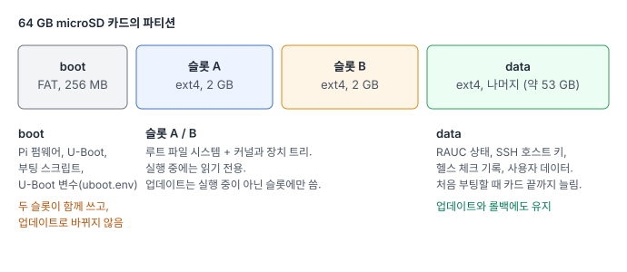
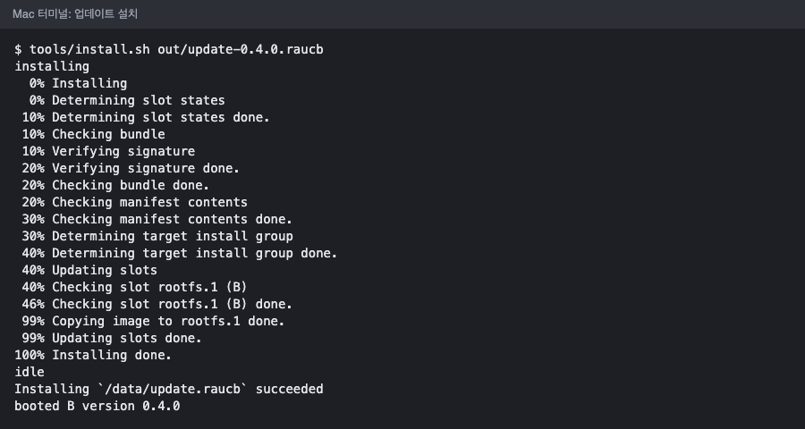
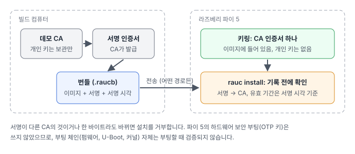
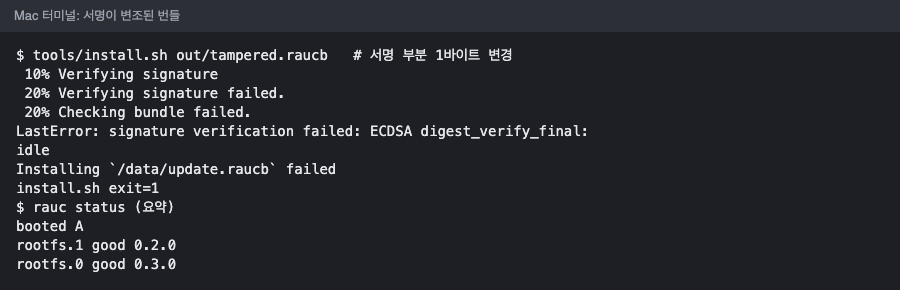
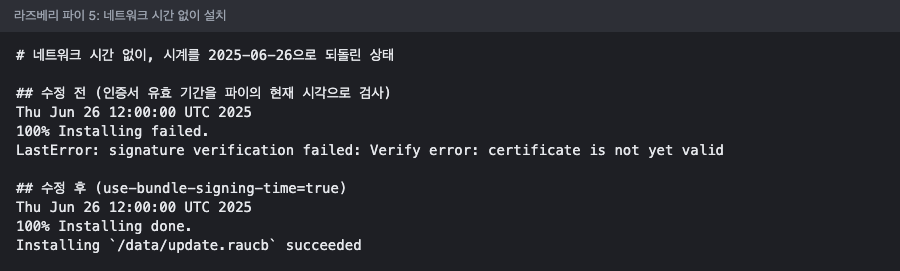
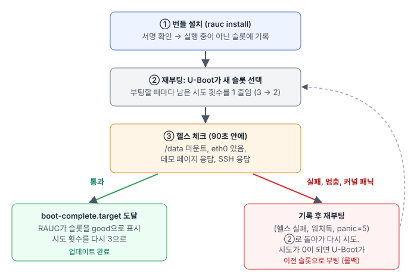
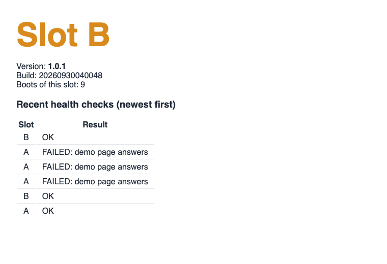

현장에 나간 장비의 소프트웨어 업데이트가 실패하면 비용이 큽니다. 원격으로 고칠 수 없으면 사람이 가야 하고, 장비가 많으면 회수해야 합니다. 그래서 업데이트 기능을 만들 때 가장 먼저 정해야 하는 것은 "어떻게 설치하느냐"보다 "**실패했을 때 어떻게 되느냐**"입니다.

이번 글에서는 라즈베리 파이 5에 다음 조건을 만족하는 업데이트 구조를 만들고 실제 보드에서 시험했습니다.

- 시스템을 두 벌(A/B 슬롯) 두고, 업데이트는 **지금 실행 중이 아닌 쪽**에만 씁니다.
- 우리 인증 기관(CA)이 서명한 업데이트만 설치합니다. 한 바이트라도 바뀌면 거부합니다.
- 새 시스템이 스스로 **정상임을 증명하지 못하면**, 커널 패닉이 나더라도, 몇 번 다시 시도한 뒤 **이전 시스템으로 자동 복귀**합니다.
- 설치 도중 전원이 나가도 이전 시스템은 그대로 부팅됩니다.
- 사용자 데이터는 업데이트와 롤백을 거쳐도 남습니다.

사용한 도구는 임베디드 리눅스 제품에서 널리 쓰는 오픈 소스입니다.

- **Yocto Project** 5.0 LTS(scarthgap): 필요한 패키지만 담은 이미지를 소스에서 재현 가능하게 빌드합니다. 레이어 버전은 kas 설정 파일에 커밋 단위로 고정했습니다.
- **RAUC**: 서명된 업데이트 번들을 검사하고 슬롯에 설치하며, 슬롯 상태를 관리합니다.
- **U-Boot**: 부팅할 슬롯을 고르고 시도 횟수를 셉니다.

결론부터 말하면, 정상 업데이트, 변조된 번들, 다른 CA의 번들, 망가진 이미지, 커널 패닉, 설치 중 리셋까지 모든 시나리오가 **설계대로 동작했습니다**(각 3회). 망가진 이미지를 설치하면 약 5분 뒤 이전 시스템으로 스스로 돌아왔고, 데이터는 그대로였습니다.

## 구성

SD 카드는 네 부분으로 나눴습니다.

- **boot**(FAT): 라즈베리 파이 펌웨어, U-Boot, 부팅 스크립트, 그리고 U-Boot가 기억하는 값(부팅 순서와 남은 시도 횟수)이 들어 있습니다. 두 슬롯이 **함께 쓰는** 유일한 부분입니다.
- **슬롯 A, 슬롯 B**(각 2 GB): 각각 완전한 루트 파일 시스템입니다. 커널과 장치 트리도 슬롯 안에 넣어서, 커널 업데이트도 슬롯 단위로 되돌릴 수 있게 했습니다. 실행 중에는 **읽기 전용**으로 마운트합니다.
- **data**(나머지, 약 53 GB): RAUC 상태, SSH 호스트 키, 헬스 체크 기록, 사용자 데이터. 처음 부팅할 때 카드 끝까지 늘어나고, 업데이트와 롤백에 영향받지 않습니다.

업데이트 파일(RAUC 번들)은 개발 PC에서 만든 뒤 네트워크로 파이에 보내고, 파이에서 `rauc install`로 설치합니다. 이 글에서는 이더넷 케이블로 Mac과 직접 연결했지만, 번들이 어떤 경로로 왔는지는 중요하지 않습니다. 그 이유가 다음 절입니다.

## 서명: 번들이 어디서 왔든 믿을 것은 서명뿐

빌드할 때 데모용 CA와 서명 키를 만들고, 번들에 서명합니다. 파이 이미지에는 **CA 인증서 하나만** 들어가고, 개인 키는 들어가지 않습니다(빌드 결과를 검사하는 테스트가 있습니다). RAUC는 설치를 시작하기 전에 서명을 확인하므로, 서명 부분을 한 바이트만 바꿔도 아무것도 쓰기 전에 거부합니다.

번들 내용(이미지 부분)을 바꾸면 조금 다르게 동작합니다. RAUC의 verity 형식 번들은 이미지를 읽으면서 블록 단위로 검사하기 때문에, **실행 중이 아닌 슬롯에 일부를 쓴 뒤** 오류를 발견합니다. 이때 RAUC는 그 슬롯을 `bad`로 표시하고 절대 활성화하지 않습니다. 실행 중인 시스템과 데이터는 영향이 없고, 다음 정상 업데이트가 그 슬롯을 다시 씁니다.

### 개발 PC에서는 보이지 않던 문제: 시계

리뷰 과정에서 찾고 실제 보드에서 재현한 문제입니다. 라즈베리 파이 5에는 기본으로 RTC 배터리가 없어서, 네트워크 시간을 받기 전에는 systemd가 시계를 **자기 빌드 날짜**(2025년 6월)로 맞춥니다. 우리 인증서는 2026년 9월에 만들었으니, 파이 입장에서는 "아직 유효 기간이 시작되지 않은" 인증서입니다. 인터넷이 없는 현장이라면 업데이트가 전부 거부됩니다.

RAUC의 `use-bundle-signing-time` 설정을 켜면, 인증서 유효 기간을 파이의 현재 시각이 아니라 **번들에 서명한 시각**을 기준으로 검사합니다. 시계를 2025년으로 되돌리고 네트워크 시간을 끈 상태에서 수정 전후를 비교했습니다.

## 헬스 체크와 자동 롤백

업데이트 후 재부팅하면 U-Boot가 새 슬롯을 고르고, **남은 시도 횟수를 3에서 2로 줄여 저장한 뒤** 부팅합니다. 이 횟수를 다시 3으로 돌려놓는 것은 RAUC의 "mark good" 서비스뿐이고, 이 서비스는 systemd의 `boot-complete.target`에 도달해야 실행됩니다. 우리는 그 앞에 **헬스 체크 서비스**를 두었습니다.

헬스 체크는 90초 안에 다음을 확인합니다.

- `/data`가 마운트되었는가
- 이더넷 장치(`eth0`)가 있는가
- 데모 웹 페이지가 응답하는가(이 장비의 "주 기능" 역할)
- SSH가 응답하는가(원격으로 관리할 수 없는 장비는 정상이 아닙니다)

"네트워크에 연결되었는가"가 아니라 "이더넷 장치가 있는가"를 본 것은 의도한 것입니다. 케이블이 빠져 있다는 이유로 정상적인 업데이트를 되돌리면 안 되기 때문입니다.

헬스 체크가 실패하면 이유를 `/data`에 기록하고 재부팅합니다. 커널 패닉이면 5초 뒤 재부팅하고(`kernel.panic=5`), 시스템이 멈추면 하드웨어 워치독이 15초 뒤 보드를 리셋합니다. 어느 경우든 시도 횟수가 0이 되면 U-Boot는 이전 슬롯으로 부팅합니다.

아래는 데모 페이지입니다. 망가진 이미지(데모 서비스가 시작되지 않게 만든 버전)를 슬롯 A에 설치했더니, A에서 세 번 실패하고 B로 돌아온 상태입니다.

### 부트 파티션은 업데이트되지 않는다

커널이 패닉 후 재부팅하게 하는 `panic=5`를 처음에는 커널 명령줄(`cmdline.txt`)에 넣었습니다. 그런데 이 파일은 두 슬롯이 함께 쓰는 **부트 파티션**에 있고, RAUC 번들은 슬롯만 바꿉니다. 즉 새로 굽는 SD 카드에만 적용되고, 업데이트로 받은 장비에는 **영원히 적용되지 않습니다**. 그래서 슬롯 안의 `/etc/sysctl.d`에서 `kernel.panic = 5`를 설정하도록 바꿨습니다.

같은 이유로 라즈베리 파이 펌웨어와 U-Boot, 부팅 스크립트는 공장에서 구운 버전 그대로 남습니다. 이것들까지 업데이트하려면 별도의, 훨씬 조심스러운 절차가 필요합니다. 제품을 설계할 때 "무엇이 슬롯 안에 있고 무엇이 공유 영역에 있는가"를 처음부터 나눠 두어야 하는 이유입니다.

## 시험 결과

실제 라즈베리 파이 5(2 GB)에서 Mac에 연결한 스크립트로 각 시나리오를 3회씩 실행했습니다.

| 시나리오 | 결과 | 확인한 것 |
|---|---|---|
| 정상 업데이트 | 3/3 | 실행 중이 아닌 슬롯으로 전환, 새 버전, good 표시, 데이터 그대로 |
| 서명 부분을 변조한 번들 | 3/3 | 쓰기 전에 거부, 두 슬롯 모두 그대로 |
| 이미지 부분을 변조한 번들 | 3/3 | 복사 중에 발견, 비활성 슬롯은 bad로 표시하고 활성화하지 않음, 실행 중인 슬롯 그대로 |
| 다른 CA가 서명한 번들 | 3/3 | 서명 오류로 거부 |
| 서비스가 망가진 이미지 | 3/3 | 헬스 체크 3회 실패 후 약 5분(314~319초) 만에 이전 슬롯으로 복귀 |
| 커널 패닉이 나는 이미지 | 3/3 | 세 번 패닉 후 이전 슬롯으로 복귀, 새 슬롯은 bad |
| 설치 중 리셋 | 3/3 | 이미지 복사 91~94% 지점에서 리셋, 이전 슬롯으로 정상 부팅, 재시도 성공 |
| 데이터 유지 | 1/1 | 모든 시나리오를 거친 뒤에도 표식 파일 그대로 |

최종 리뷰에서 나온 수정(아래 참고)을 넣은 1.0.1 이미지로 정상 업데이트와 망가진 이미지 복귀를 한 번씩 더 확인했고, 둘 다 통과했습니다(복귀 335초). 전체 기록은 저장소의 `docs/test-log.md`에 있습니다.

롤백 시나리오는 "원래 슬롯에서 돌아가고 있다"만으로 통과시키지 않았습니다. 망가진 슬롯이 실제로 시도되었는지(U-Boot의 남은 시도 횟수가 0), RAUC가 그 슬롯을 `bad`로 표시했는지, 그 슬롯에서 헬스 체크 실패 기록이 남았는지까지 확인해야 통과입니다. 설치가 조용히 실패해서 새 슬롯으로 한 번도 가지 않은 경우를 "롤백 성공"으로 잘못 세지 않기 위해서입니다.

## 만들면서 만난 문제들

- **네트워크가 안 된다, 그런데 파이는 멀쩡했다.** 처음 부팅한 이미지가 네트워크에 나타나지 않았습니다. 모니터도 시리얼 케이블도 없어서, 부팅 30초 뒤 네트워크 상태, 커널 로그, systemd 저널을 **FAT 부트 파티션에 저장하는 디버그 이미지**를 만들었습니다. SD 카드를 Mac에 꽂아 읽어 보니 파이 쪽은 정상이었고, 원인은 **Mac의 USB 이더넷 어댑터**였습니다. 링크는 올라와 있는데 송수신 패킷 수가 양쪽 모두 멈춰 있었고, 다시 꽂자 바로 해결됐습니다. 장비를 의심하기 전에 양쪽 끝의 패킷 수부터 보는 것이 순서였습니다.
- **키가 없으면 예제 키로 조용히 빌드될 수 있었다.** 참고한 커뮤니티 레이어에는 공개된 예제 CA가 들어 있습니다. 우리 키 파일이 없을 때 그 예제로 대신 빌드되지 않도록, 레이어 안에서 빌드를 멈추게 했습니다.
- **SSH 포트가 열려 있다고 SSH가 동작하는 것은 아니었다.** 이 이미지에서는 systemd가 SSH 포트를 대신 열어 두었다가 접속이 오면 sshd를 띄웁니다. 그래서 포트 확인만으로는 sshd가 실제로 뜨는지 알 수 없어서, SSH 서버의 첫 인사(`SSH-2.0-`)를 받아야 통과하도록 바꿨습니다. 같은 리뷰에서, 아무것도 보내지 않는 접속 하나가 데모 페이지를 90초 넘게 붙잡아 정상 슬롯을 되돌릴 수 있다는 점도 찾아 고쳤습니다.
- **데이터 파티션을 늘리는 서비스가 매 부팅마다 파티션 표를 다시 썼다.** 크기가 이미 최대여도 파티션 표(MBR)를 다시 쓰고 있었습니다. MBR은 두 슬롯이 공유하는 부분이라, 쓰는 도중 전원이 나가면 A/B 구조가 무의미해집니다. 늘릴 공간이 있을 때만 실행하도록 바꿨습니다.

## 이번 구성의 한계

- **하드웨어 보안 부팅은 쓰지 않았습니다.** 라즈베리 파이 5는 OTP(한 번만 쓸 수 있는 메모리)에 키를 새겨 부팅 체인을 검증할 수 있지만, 되돌릴 수 없는 작업이라 이번 데모에서는 의도적으로 제외했습니다. 따라서 번들 서명은 "무엇을 설치할지"를 지키지만, 부팅할 때 펌웨어, U-Boot, 커널 자체를 검증하지는 않습니다.
- **두 슬롯이 모두 망가지면** 부팅 스크립트가 시도 횟수를 초기화하고 재부팅을 반복합니다. 제품이라면 복구 모드나 공장 이미지가 필요합니다.
- **실제 전원 차단 시험은 소프트웨어 리셋으로 대신했습니다.** 설치 중 `sysrq`로 즉시 재부팅시키는 방식이고, 케이블을 뽑는 시험과 케이블을 뺀 채 부팅하는 시험은 이번 글에 포함하지 않았습니다.
- 데모용 키, SD 카드 수명, 암호화되지 않은 데이터 파티션도 제품에서는 다시 설계해야 합니다.

## 실제 제품으로 확장한다면

| 적용 분야 | 이번 작업에서 그대로 쓰는 부분 | 제품으로 만들 때 더할 부분 |
|---|---|---|
| 산업용 게이트웨이, 엣지 장비 | A/B 슬롯, 서명된 번들, 헬스 체크와 자동 롤백 | 하드웨어 보안 부팅, 데이터 암호화, 원격 배포 서버 |
| 영상·키오스크 단말 | 읽기 전용 루트, 데이터 분리 | 화면·앱 상태를 포함한 헬스 체크, 단계적 배포 |
| 로봇·무인 장비의 컴패니언 컴퓨터 | 커널 패닉·멈춤 시 자동 복귀 | 비행·주행 중 업데이트 금지 조건, 이중화 |
| MCU를 거느린 리눅스 장비 | 서명 검증 흐름 | MCU 펌웨어(MCUboot)까지 함께 업데이트하는 절차 |

업데이트 기능에서 어려운 부분은 설치 자체가 아니라, 새 시스템이 **정상인지 판단하는 기준**과 그 판단이 틀렸을 때 **돌아갈 길**을 설계하는 일입니다. 이번 글의 문제들도 대부분 개발 PC에서는 보이지 않고 실제 보드에서만 드러났습니다.

다음 글에서는 이 구조 위에 AWS IoT를 연결해, Wi-Fi로 여러 장비에 업데이트를 배포하고 결과를 모으는 OTA를 만들 예정입니다. 빌드와 시험 자동화 전반은 [임베디드 펌웨어의 CI/CD 글](/posts/2026-09-embedded-ci-cd/)에 정리해 두었습니다.

임베디드 리눅스 업데이트 구조, Yocto 기반 이미지 빌드, 현장 장비의 안전한 배포가 필요하시면 언제든 연락 주세요.
