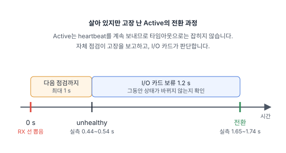

[1편](/posts/2026-09-redundant-controller/)에서는 Raspberry Pi 두 대를 Active/Standby 제어기로, STM32F3 Discovery를 I/O 카드이자 심판으로 써서, Active의 전원을 뽑으면 약 100 ms 만에 Standby가 이어받는 구조를 만들었습니다.

그런데 1편의 구조로는 잡을 수 없는 고장이 있습니다. **살아 있지만 고장 난 제어기**입니다. 예를 들어 I/O 카드에서 Active로 가는 UART 선 한 가닥만 끊기면, Active는 I/O 카드의 응답을 받지 못하지만 heartbeat는 계속 보냅니다. I/O 카드가 보기에는 멀쩡하게 살아 있으니 전환이 일어나지 않습니다.

이번 2편에서는 **자체 점검(BIT, Built-In Test)** 을 더해서 이런 고장을 찾고, 그 결과로 Active를 넘기도록 했습니다. 함께 점검 모드와 상위 제어기용 TCP 명령 서버도 만들었습니다.

결과부터 말하면, Active의 수신선을 뽑았을 때 **약 1.65~1.74초 만에** Standby가 Active가 되었고, LED는 끊긴 자리에서 그대로 이어서 돌았습니다.

## 무엇을 점검하나

방산·산업용 장비의 BIT는 보통 두 가지입니다. 켜질 때 한 번 하는 **PBIT(Power-on BIT)** 와, 동작 중에 계속하는 **CBIT(Continuous BIT)** 입니다. 이번에는 제어기가 시작 1초 뒤에 PBIT를, 그 뒤로 1초마다 CBIT를 합니다. 항목은 같고 시점만 다릅니다.

**제어기(Pi) 점검 항목**

| 항목 | 통과 조건 | 치명적 |
|---|---|---|
| I/O 카드 링크 | 응답(STATUS)이 100 ms 넘게 끊긴 적이 없고, CRC 오류가 1초에 5개 미만 | 예 |
| 제어 루프 주기 | heartbeat 간격이 50 ms를 넘은 적이 없음 | 예 |
| 제어기 간 링크 | 상대의 메시지가 100 ms 안에 옴 | 아니오 |
| 전원 전압 | 커널의 저전압 경고가 없음 | 아니오 |
| CPU 온도 | 80 °C 미만 | 아니오 |

"치명적" 항목이 실패하면 제어기는 자신을 **unhealthy**로 표시합니다. 나머지 항목은 기록과 보고만 합니다. 제어기 간 링크는 1편에서 정한 대로 감시용이라서 역할 판단에 쓰지 않습니다.

실제로 이번 실험 환경에서는 두 Pi 모두 전원 어댑터가 약해서 **전원 전압 항목이 계속 실패**했습니다. 치명적 항목이 아니므로 두 제어기 모두 healthy를 유지했고, 점검 결과에는 정직하게 fail로 남았습니다. 현장 장비라면 "동작은 하지만 전원을 점검하라"는 경고에 해당합니다.

**I/O 카드(STM32) 점검 항목**

| 항목 | 방법 |
|---|---|
| GPIO 루프백 | PD12 출력을 점퍼선으로 PD13 입력에 연결하고, High/Low를 써서 다시 읽음 |
| LED 출력 | LED 핀의 실제 상태가 마지막으로 적용한 값과 같은지 읽어서 확인 |
| 센서 | 보드의 가속도·지자기 센서가 준비되었는지 확인(나침반 편에서 쓴 센서) |
| UART 오류 | 슬롯별 CRC·길이 오류가 1초에 5개 미만 |
| 리셋 원인 | 마지막 리셋이 워치독 때문이었는지 |

I/O 카드는 이중화되어 있지 않으므로, 이 결과는 보고만 하고 역할에는 영향을 주지 않습니다.

## 점검 결과가 역할을 바꾸는 방법

1편의 원칙은 그대로입니다. **Active를 정하는 것은 I/O 카드뿐이고, 제어기는 스스로 물러나지 않습니다.** 제어기는 20 ms마다 보내는 heartbeat에 `healthy` 한 바이트를 더해서 자기 상태를 알리기만 합니다.

| 상황 | I/O 카드의 판단 |
|---|---|
| Active가 unhealthy이고 Standby가 healthy인 상태가 **1.2초 동안 계속됨** | Standby에 Active를 넘김 |
| Active가 unhealthy인데 Standby도 unhealthy이거나 없음 | 그대로 둠(아무도 없는 것보다 낫다) |
| Active의 heartbeat가 끊김 | 1편과 같이 즉시 넘김(Standby가 unhealthy여도) |
| unhealthy였던 제어기가 회복됨 | Standby로 남음(되돌아가지 않음) |

제어기가 회복될 때는 **3회 연속 통과**해야 healthy로 돌아옵니다. 경계에 걸린 고장 때문에 역할이 오락가락하지 않도록 하기 위해서입니다.



## 1.2초를 기다리는 이유: 공통 고장

처음 설계에는 이 1.2초 보류가 없었습니다. 구현 계획을 쓰면서 한 가지 경우를 따져 보다가 문제를 찾았습니다. **I/O 카드 자체가 재시작하는 경우**입니다.

I/O 카드가 재시작하면 두 제어기 모두 응답을 잃으므로 **둘 다** unhealthy가 됩니다. 그런데 두 제어기의 1초 점검 주기는 서로 맞춰져 있지 않아서, 회복하는 시점이 최대 1초까지 차이 납니다. Standby가 먼저 회복하면, 그 순간에는 "Active unhealthy, Standby healthy"가 되어 Active가 넘어갑니다. 1편에서 확인했던 "I/O 카드가 재시작해도 역할은 바뀌지 않는다"가 깨지는 것입니다.

그래서 이 조건이 **점검 주기(1초)보다 긴 1.2초 동안 계속될 때만** 넘기도록 했습니다. 두 제어기가 같은 원인으로 함께 고장 난 경우(공통 고장)는 1초 안에 함께 회복하므로 넘어가지 않고, 한 제어기만 고장 난 경우는 1.2초 뒤에 넘어갑니다.

### 코드 리뷰에서 찾은 문제

구현을 마친 뒤, 전체 코드를 새로 리뷰하는 과정에서 이 논리에 구멍이 하나 더 있다는 것을 찾았습니다.

처음 구현의 I/O 카드 링크 점검은 **점검하는 그 순간**의 응답 나이만 봤습니다. 그런데 I/O 카드가 0.1~0.2초 정도 잠깐 멈추면, 그 짧은 틈에 점검 시점이 걸린 제어기만 고장을 봅니다. 다른 제어기는 그 틈을 그냥 지나칩니다. 공통 고장인데 한쪽만 보고, 그 쪽이 마침 Active라면 1.2초 뒤에 Active가 넘어갑니다. 확률로는 열 번에 한두 번 정도입니다.

고친 방법은 단순합니다. 점검할 때 "지금 응답이 얼마나 오래됐나"가 아니라, **"지난 점검 이후 가장 길었던 응답 공백"** 을 봅니다. 제어 루프 주기 항목이 이미 그렇게 동작하고 있었습니다. 이렇게 하면 어떤 공백이든 두 제어기가 같은 주기 안에서 함께 봅니다.

```c
/*
 * Longest time without STATUS since the previous call, including the gap
 * still open at now_ms. BIT uses it so that every gap is seen within one
 * check period, whatever the check phase.
 */
int64_t role_take_status_age(struct role_state *s, int64_t now_ms);
```

수정 후 디버거로 STM32를 150 ms씩 다섯 번 멈춰 봤습니다. 다섯 번 모두 **두 제어기가 함께** 고장을 기록하고 함께 회복했으며, 역할은 한 번도 바뀌지 않았습니다.

이런 문제는 정상 동작 테스트로는 거의 드러나지 않습니다. "무엇이 동시에, 어떤 순서로 일어날 수 있나"를 따져 보는 설계 검토와 리뷰가 필요한 부분입니다.

## 점검 모드와 TCP 명령

STM32의 파란 USER 버튼으로 **운용 모드**와 **점검 모드**를 바꿉니다. 점검 모드에서는 Active가 LED 패턴을 멈추고, 작업자가 TCP로 LED를 직접 켜고 끌 수 있습니다. 운용 모드에서 TCP는 조회만 가능합니다.

모드는 **물리 버튼으로만** 바꿀 수 있습니다. 원격에서 동작 중인 시스템을 점검 모드로 바꿀 수 있다면 그 자체가 위험이기 때문입니다.

TCP 서버는 두 제어기 모두에서 동작하고(포트 5000), 한 줄짜리 텍스트 명령에 한 줄짜리 JSON으로 답합니다. `nc`만으로도 쓸 수 있습니다.

```
$ nc 192.168.45.50 5000
STATUS
{"ok":true,"slot":"A","role":"active","mode":"operational","healthy":true,"active":"A",...}
LEDS 0x55
{"ok":false,"error":"operational mode"}
```

| 명령 | 운용 모드 | 점검 모드 | Standby에서 |
|---|---|---|---|
| `STATUS`, `BIT` | 응답 | 응답 | 응답 |
| `LEDS <hex>` | 거부 | LED 설정 | 거부(현재 Active 알려 줌) |
| `LAMP_TEST` | 거부 | 전체 켜기 1초, 끄기 1초 | 거부 |
| `RUN_BIT` | 거부 | 즉시 점검 | 거부 |

상위 제어기 역할의 Python 클라이언트 `rcctl`은 두 제어기에 모두 접속해서 상태를 나란히 보여 주고, 출력 명령은 **I/O 카드가 Active로 인정한 쪽**에만 보냅니다. 스스로 Active라고 믿지만 I/O 카드와 연결이 끊긴 제어기에 명령을 보내면, 응답은 "성공"인데 출력은 바뀌지 않는 상황이 생기기 때문입니다(이것도 리뷰에서 찾은 문제입니다).

```
$ rcctl status
             192.168.45.50         192.168.45.176
role         active                standby
mode         operational           operational
healthy      True                  True
...
```

### 제어를 방해하지 않는 TCP 서버

제어기 데몬은 `poll()` 하나로 UART, 제어기 간 링크, 타이머, TCP를 모두 처리하는 단일 스레드 프로그램입니다. 그래서 TCP 클라이언트가 이상하게 동작해도 **heartbeat가 늦어지면 안 됩니다.** 늦어지면 제어 루프 주기 점검이 실패해서 멀쩡한 Active가 넘어가 버립니다.

- 모든 소켓은 non-blocking이고, 응답을 다 보내지 못하면(상대가 읽지 않으면) 그 클라이언트만 끊습니다.
- 한 줄이 128바이트를 넘으면 오류를 보내고 끊습니다.
- 동시 접속은 4개까지이고, 다섯 번째는 바로 닫습니다.
- `RUN_BIT`는 0.5초에 한 번까지만 실제로 실행합니다. 또 필요할 때 하는 점검은 결과만 갱신하고 healthy 판단에는 쓰지 않습니다. 명령을 연달아 보내서 "3회 연속 통과"를 빨리 채우지 못하게 하기 위해서입니다.

실제로 클라이언트 4개가 3초 동안 `RUN_BIT` 35,648개를 보내 봤지만, 제어 루프 주기 점검은 한 번도 실패하지 않았고 역할도 바뀌지 않았습니다.

## 실험 결과

측정할 때 두 Pi 모두 전원이 약간 부족한 상태(저전압 경고)였습니다.

**실험 1: 부팅 점검(PBIT)**: 두 데몬을 함께 재시작, 3회

세 번 모두 두 제어기의 PBIT가 통과했고 healthy가 되었습니다. 제어 루프 간격은 최대 20~21 ms, CPU 온도는 47~49 °C였습니다. 전원 전압 항목만 저전압으로 실패했습니다.

**실험 2: 살아 있지만 고장 난 Active**: Active의 수신선(Pi 10번 핀)을 뽑음, 3회

| 회차 | 전환 | 고장 → unhealthy | 고장 → 전환 |
|---|---|---|---|
| 1 | B → A | 444 ms | 약 1.65 s |
| 2 | A → B | 536 ms | 약 1.74 s |
| 3 | B → A | 524 ms | 약 1.72 s |

I/O 카드 로그의 `gap_ms`는 2~3 ms였습니다. 즉 옛 Active는 heartbeat를 계속 보내고 있었고, 타임아웃이 아니라 **자체 점검 결과로** 전환된 것입니다. 1편의 구조로는 전환되지 않던 고장입니다. 새 Active는 LED를 끊긴 자리에서 이어서 돌렸고, 선을 다시 꽂은 제어기는 약 3.5초 뒤 healthy로 돌아와 Standby로 남았습니다.

**실험 3: 점검 모드**: 3회

버튼으로 점검 모드에 들어가 `rcctl leds 0x55`로 LED를 하나 건너 하나씩 켠 뒤, Active의 데몬을 멈췄습니다. 세 번 모두 새 Active가 **같은 LED 패턴을 그대로 유지**했습니다. 램프 테스트 후에도 패턴이 돌아왔고, 버튼으로 운용 모드로 돌아가면 LED 패턴이 다시 돌고 `leds` 명령은 거부되었습니다.

**실험 4: I/O 카드 점검**: 루프백 점퍼선을 뽑음

뽑을 때마다 1초 안에 루프백 실패(`fail=0x01`)가 기록되었고, 다시 꽂으면 정상으로 돌아왔습니다. 역할은 바뀌지 않았습니다.

**실험 5: I/O 카드 재시작(1편 결과 재확인)**: STM32를 3초 동안 리셋 상태로 잡음, 3회

세 번 모두 두 제어기가 함께 unhealthy가 되었다가 함께 회복했고, I/O 카드는 재시작 후 이전 Active를 다시 뽑았습니다. 1.2초 보류가 의도대로 동작한 것입니다.

## 실제 제품으로 확장한다면

BIT는 방산·항공 장비에서는 거의 필수 요구사항이고, 산업·인프라 장비에서도 점점 많이 요구됩니다. 이번 데모의 구조는 이런 제품에 그대로 쓰입니다.

| 적용 분야 | 이번 작업에서 그대로 쓰는 부분 | 제품으로 만들 때 더할 부분 |
|---|---|---|
| 방산·항공 제어 유닛 | PBIT/CBIT, 치명적/경고 구분, 점검 모드, 상위 제어기 인터페이스 | IBIT(작업자 시작 점검) 항목 확장, 고장 이력 저장, 요구사항별 시험 문서 |
| 철도·플랜트 제어기 | BIT 결과로 이중화 전환, 공통 고장 처리, 안전 상태 | 안전 무결성(SIL) 분석, 출력 되읽기 비교, 인증용 문서 |
| 통신·전력 설비의 제어 보드 | 원격 상태 조회, 전원·온도 감시 | SNMP/Modbus 연동, 원격 로그 수집, 무중단 업데이트 |
| 의료·계측 장비 | 부팅 자체 점검, 점검 모드 분리 | 규격(IEC 60601 등)에 맞춘 점검 항목과 기록 |

이번 작업에서도 가장 시간이 많이 든 부분은 점검 항목을 만드는 일이 아니라, **점검 결과가 이중화 판단과 만났을 때 생기는 경우들**(공통 고장, 점검 시점 차이, 명령 폭주)을 찾아서 막는 일이었습니다.

비슷한 이중화·자체 점검 설계나 임베디드 Linux·Zephyr 기반 개발이 필요하시면 언제든 연락 주세요.
