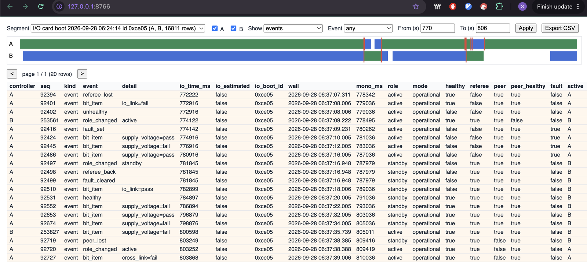
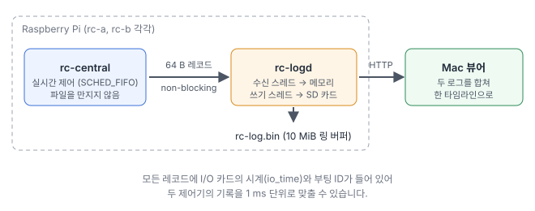

[1편](/posts/2026-09-redundant-controller/)에서는 Raspberry Pi 두 대와 STM32 I/O 카드로 Active/Standby 이중화 제어기를 만들었고, [2편](/posts/2026-09-redundant-controller-bit/)에서는 자체 점검(BIT)으로 "살아 있지만 고장 난" 제어기를 찾아 넘기도록 했습니다.

현장에서 전환이 일어나면 가장 먼저 받는 질문은 "그때 무슨 일이 있었나?"입니다. 두 제어기가 각자 로그를 남기더라도, 서로 시계가 다르면 어느 쪽 사건이 먼저였는지조차 맞추기 어렵습니다. 이번 3편에서는 항공기의 블랙박스처럼 **고장 순간을 다시 볼 수 있는 기록 장치**를 만들었습니다.

- 각 제어기가 100 ms마다 상태 스냅샷을, 사건이 생기면 즉시 이벤트 기록을 남깁니다.
- 기록은 SD 카드의 10 MiB 링 버퍼에 쌓이고, 약 4.5시간을 보관합니다. 가득 차면 가장 오래된 것부터 덮어씁니다.
- Mac의 로그 뷰어가 두 제어기의 로그를 내려받아 **한 타임라인**으로 합치고, 표와 필터, CSV 내보내기를 제공합니다.



## 무엇을 기록하나

기록 하나는 64바이트 고정 크기입니다. 역할, 모드, healthy 여부, 두 링크 상태, I/O 카드가 알려 준 Active 슬롯, 자체 점검 다섯 항목의 결과, LED 상태, 그리고 세 가지 시각(I/O 카드 시각, 제어기 가동 시간, 벽시계 시각)이 들어갑니다. 끝에는 CRC가 붙어서, 쓰는 도중에 읽힌 기록이나 손상된 기록은 걸러집니다.

기록은 두 종류입니다.

| 종류 | 언제 | 용도 |
|---|---|---|
| 스냅샷 | 100 ms마다 | 끊김 없는 흐름: LED 위치, 응답 나이 등 |
| 이벤트 | 사건이 생긴 즉시 | 정확한 순간: 역할 변경, healthy/unhealthy, 링크 끊김/복구, 모드 변경, 점검 항목 변화, TCP 명령 |

스냅샷만 있으면 100 ms 사이에 일어난 일의 정확한 시각을 알 수 없고, 이벤트만 있으면 그 사이의 흐름이 보이지 않습니다. 둘을 함께 남기면 뷰어에서 "이벤트만 보기"로 이야기를 따라가다가, 필요한 구간만 스냅샷까지 펼쳐 볼 수 있습니다.

## 두 제어기의 시간을 맞추기

두 로그를 합치려면 공통의 시계가 필요합니다. Pi의 벽시계는 네트워크 시간(NTP)에 의존하는데, Raspberry Pi에는 배터리로 유지되는 시계가 없습니다. 실제로 이번 실험 중 아침에 전원을 켰을 때, 두 Pi는 네트워크 시간을 받기 전까지 **전날 저녁 시각으로** 기록을 남겼습니다.

그래서 두 제어기가 이미 공유하는 것을 시계로 썼습니다. **I/O 카드**입니다.

- I/O 카드는 20 ms마다 보내는 응답에 자신의 가동 시간(ms)을 넣습니다. 제어기는 기록할 때마다 "마지막 응답의 I/O 카드 시각 + 그 뒤로 지난 시간"을 적습니다. 두 제어기의 기록이 약 1 ms 단위로 맞습니다.
- I/O 카드가 재시작하면 시계가 0으로 돌아가므로, I/O 카드는 켜질 때마다 새 **부팅 ID**를 정해 함께 보냅니다. 뷰어는 같은 부팅 ID의 기록끼리 묶습니다. 벽시계가 틀려도 합치는 데는 영향이 없습니다.

이 STM32에는 하드웨어 난수 발생기가 없어서, 첫 heartbeat가 도착한 순간의 CPU 사이클 카운터로 부팅 ID를 만듭니다. 72 MHz 카운터에서 그 순간은 켤 때마다 달라집니다.

## 실시간 루프와 SD 카드: 기록이 제어를 멈추다

처음 구조는 단순했습니다. 제어 데몬이 기록을 파일에 직접 썼습니다. 64바이트 쓰기 한 번은 보통 커널의 페이지 캐시에 들어가고 바로 끝나니, 제어 루프에 영향이 없을 것이라고 생각했습니다.

전체 코드 리뷰에서 "SD 카드가 바쁘면 이 쓰기도 멈출 수 있다"는 지적이 나왔고, 실제로 확인해 봤습니다. Active Pi의 SD 카드에 300 MB를 복사하는 동안의 결과입니다.

- 로그 쓰기 한 번이 **3.4초**, 또 한 번이 **3.7초** 동안 멈췄습니다.
- 그동안 heartbeat가 나가지 않아 I/O 카드가 Active를 Standby로 넘겼습니다. **평범한 파일 복사가 실제 전환을 일으킨 것입니다.**

리눅스는 디스크에 쓸 데이터가 너무 많이 쌓이면, 쓰려는 프로세스를 우선순위와 상관없이 잠시 세웁니다. 실시간 우선순위(SCHED_FIFO)도 예외가 아닙니다.



그래서 구조를 바꿨습니다. **제어 데몬은 파일을 전혀 만지지 않습니다.** 기록을 64바이트 데이터그램으로 만들어 로컬 소켓으로 `rc-logd`에 보내기만 하고, 보낼 수 없으면 기다리지 않고 버린 뒤 그 개수를 셉니다. 다음에 보낼 수 있게 되면 "몇 개를 잃었다"는 이벤트를 남기므로, 기록이 조용히 사라지지는 않습니다. 파일 쓰기, SD 카드 반영(2초마다 fsync), 다운로드 제공은 낮은 우선순위의 `rc-logd`가 맡습니다.

같은 300 MB 복사를 다시 해 봤습니다. 제어 루프 지연도, 역할 변경도, 잃은 기록도 없었습니다.

여기서 문제가 하나 더 나왔습니다. 리눅스는 이런 소켓에 데이터그램을 **10개까지만** 쌓아 둡니다. 기록 1초 분량입니다. `rc-logd`가 쓰기 때문에 1초 넘게 멈추면 제어 데몬이 기록을 버려야 합니다. 그래서 `rc-logd` 안에서도 **받는 스레드와 쓰는 스레드를 나눴습니다.** 받는 스레드는 소켓에서 메모리로 옮기기만 하고, 디스크는 쓰는 스레드만 기다립니다.

실시간 시스템에서 "빠르니까 괜찮겠지"라는 가정이 얼마나 위험한지 보여 준 사례입니다. 평소에는 1 ms도 걸리지 않는 쓰기가, 다른 프로그램이 디스크를 쓰는 순간 수 초가 됩니다.

## Mac 로그 뷰어

뷰어는 Python 표준 라이브러리만 쓰는 작은 프로그램입니다. 추가로 설치할 것이 없고, 인터넷 연결도 필요 없습니다.

```
$ tools/rcview.py                       # 두 제어기의 로그를 받아 뷰어 열기
$ tools/rcview.py --open logs/*.bin     # 저장해 둔 로그 보기
```

- 두 제어기의 로그를 내려받아 저장하고, 로컬 웹 페이지(`127.0.0.1`)로 보여 줍니다. 현장에서 받아 온 로그를 나중에 사무실에서 열어 볼 수도 있습니다.
- I/O 카드 부팅 단위로 구간을 나누고, 두 제어기의 기록을 I/O 카드 시각 순서로 합칩니다.
- 위쪽 띠에는 제어기별 역할이 색으로 표시되고, 빨간 선은 주요 이벤트입니다. 띠를 누르면 그 시각 전후로 표가 이동합니다.
- 제어기, 기록 종류, 이벤트 종류, 시간 범위로 거를 수 있고, 지금 보이는 행을 **CSV로 내보내면** Excel에서 바로 열립니다.

로그는 제어기마다 약 16만 행, 두 개를 합치면 약 33만 행입니다. 필터와 페이지 나누기는 서버 쪽에서 처리하므로, 브라우저에는 한 번에 500행만 보냅니다.

## 실험 결과

측정할 때 두 Pi는 여전히 전원이 약간 부족한 상태였습니다.

**로그에서 다시 본 전환 1: Active의 수신선을 뽑음**

위 스크린샷의 표를 시간순으로 읽으면 이렇습니다. 시각은 I/O 카드 기준입니다.

| I/O 카드 시각 | 누구 | 무슨 일 |
|---|---|---|
| 772.222 s | A | I/O 카드 응답이 끊김 |
| 772.916 s | A | 점검 실패, unhealthy |
| 774.122 s | B | Active가 됨 (I/O 카드 콘솔 기록과 2 ms 차이) |
| 774.142 s | A | 자기도 Active라고 믿는데 B도 Active → 심판 고장으로 보고 출력을 멈춤 |
| 781.845 s | A | 선을 다시 꽂음 → Standby로 복귀 |
| 784.897 s | A | healthy, Standby 유지 |

2편에서 만든 안전장치(두 제어기가 동시에 Active면 출력을 멈춤)가 실제로 동작하는 장면도 로그에 그대로 남았습니다.

**로그에서 다시 본 전환 2: Active의 전원을 뽑음**

전원이 빠진 B가 마지막으로 남긴 기록은 전환 944 ms 전의 것이었습니다. 2초마다 SD 카드에 반영하므로, 전원이 갑자기 빠져도 잃는 것은 최대 약 2초 분량입니다. A는 I/O 카드의 다음 응답(13 ms 뒤)에서 Active가 되었다는 것을 기록했습니다.

**그 밖의 실험**

| 실험 | 결과 |
|---|---|
| 10분 연속 기록 | 제어기마다 초당 약 9.9개 스냅샷, 순번 빠짐 없음, 손상 기록 0 |
| 동작 중 로그 10회 다운로드 | 제어 루프 지연, 역할 변경 없음 (다운로드는 Pi 3B Wi-Fi에서 10 MB에 약 40초) |
| Active의 SD 카드에 300 MB 쓰기 | 구조 변경 전: 3.7초 멈춤과 실제 전환 / 변경 후: 영향 없음 |

## 실제 제품으로 확장한다면

고장 기록 장치는 이중화나 자체 점검만큼이나 현장 장비에서 자주 요구됩니다. 문제가 생긴 뒤에 원인을 설명할 수 있어야 하기 때문입니다.

| 적용 분야 | 이번 작업에서 그대로 쓰는 부분 | 제품으로 만들 때 더할 부분 |
|---|---|---|
| 방산·항공 제어 유닛 | 링 버퍼 기록, 공통 시계로 여러 모듈 기록 맞추기, 다운로드와 분석 도구 | 기록 항목 정의 문서, 전원 차단에 강한 저장 매체, 암호화와 접근 제어 |
| 철도·차량 이벤트 기록 | 이벤트 즉시 기록 + 주기 스냅샷, 전원 차단 시 잃는 범위 제한 | 규격에 맞춘 기록 형식, 충격·온도에 강한 저장 장치 |
| 플랜트·설비 제어기 | 제어 루프와 분리된 기록 경로, CSV 분석 | 원격 수집, 장기 보관 서버 연동 |
| 로봇·AGV | 여러 제어기의 기록을 한 타임라인으로 합치기 | 센서 데이터 동기 기록, 대용량 저장 |

이런 장치에서 중요한 것은 기록 형식보다, **기록하는 일이 본래 기능을 절대 방해하지 않게** 만드는 것입니다. 이번 작업에서 가장 큰 수정도 바로 그 부분이었습니다.

비슷한 이중화·고장 기록 설계나 임베디드 Linux·Zephyr 기반 개발이 필요하시면 언제든 연락 주세요.
