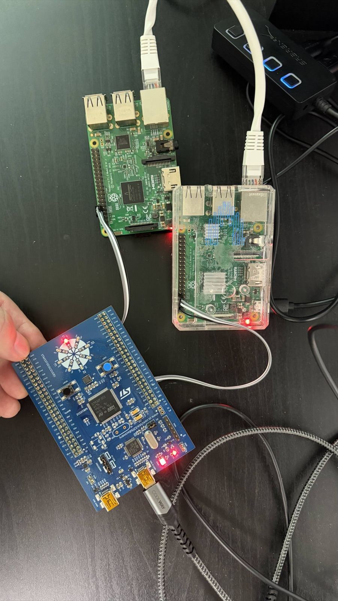
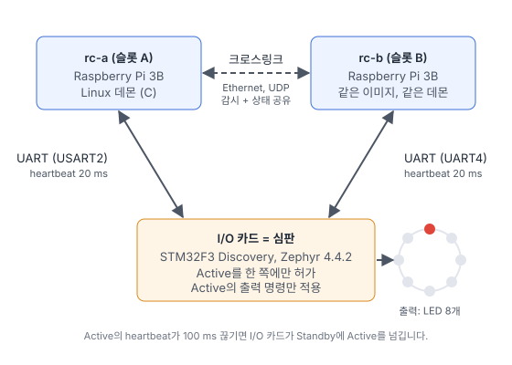

방산 장비, 철도, 플랜트처럼 제어기가 멈추면 안 되는 시스템은 보통 제어기를 두 대 둡니다. 한 대(Active)가 실제로 제어하고, 다른 한 대(Standby)는 같은 프로그램을 돌리며 기다리다가 Active가 죽으면 바로 이어받습니다. 이번 글에서는 이 **이중화(Active/Standby) 구조**를 가지고 있는 보드로 직접 만들고, 전원을 뽑아 전환 시간을 측정했습니다.

- 제어기 두 대: Raspberry Pi 3B (`rc-a`, `rc-b`), C로 작성한 Linux 데몬
- I/O 카드: STM32F3 Discovery (Rev E), Zephyr 4.4.2
- 출력: I/O 카드의 LED 8개. Active가 200 ms마다 불빛을 한 칸씩 돌립니다.

결론부터 말하면, Active의 전원을 뽑았을 때 **I/O 카드 기준 101~102 ms 만에** Standby가 Active가 되었고, LED는 끊긴 자리에서 그대로 이어서 돌았습니다.



## 구성



| 역할 | 보드 | 소프트웨어 |
|---|---|---|
| 제어기 슬롯 A | Raspberry Pi 3B `rc-a` | Linux 데몬 (C) |
| 제어기 슬롯 B | Raspberry Pi 3B `rc-b` | 같은 이미지, 같은 데몬 |
| I/O 카드, 심판 | STM32F3 Discovery Rev E | Zephyr 4.4.2 |

두 제어기는 같은 이미지를 씁니다. 자기가 A인지 B인지는 **배선으로 정해집니다.** I/O 카드의 USART2에 연결된 쪽이 A, UART4에 연결된 쪽이 B이고, I/O 카드가 응답할 때 슬롯 번호를 알려 줍니다. 설정 파일을 제어기마다 다르게 관리할 필요가 없어서, 현장에서 보드를 교체할 때 실수할 여지가 줄어듭니다.

## 가장 중요한 결정: 누가 Active를 정하는가

처음 떠오르는 방법은 두 제어기가 서로 heartbeat를 주고받다가, 상대가 조용해지면 스스로 Active가 되는 것입니다. 그런데 이 방식에는 근본적인 문제가 있습니다. **상대가 죽은 것과 둘 사이의 선이 끊긴 것을 구분할 수 없습니다.**

- 선이 끊겼을 때 바로 넘겨받으면, 두 제어기가 동시에 Active가 되어 같은 출력을 서로 다르게 움직입니다(split-brain).
- 이를 피하려고 기다리면, 진짜로 죽었을 때 아무도 제어하지 않습니다.

그래서 **I/O 카드가 심판**을 맡도록 했습니다. 출력 명령은 어차피 모두 I/O 카드를 지나가므로, I/O 카드가 Active를 한 쪽에만 허가하고 **허가한 쪽의 출력 명령만 적용**합니다. 자기가 Active라고 믿는 제어기가 있더라도 I/O 카드가 허가하지 않았다면 출력은 움직이지 않습니다. split-brain이 생겨도 출력까지 닿지 않는 구조입니다.

I/O 카드가 하나뿐이라 단일 고장점(single point of failure)이 된다는 반론이 있을 수 있습니다. 하지만 I/O 카드는 원래 모든 입출력이 지나가는 곳이라, 두 제어기가 스스로 결정하는 방식에서도 이미 단일 고장점입니다. 심판 역할이 더하는 위험은 심판 로직의 버그뿐이고, 이는 아래 세 가지로 막았습니다.

- I/O 카드는 하드웨어 워치독(IWDG)을 씁니다. 펌웨어가 멈추면 리셋되고, 리셋 시 모든 출력은 꺼진 상태(안전 상태)가 됩니다.
- 두 제어기가 크로스링크로 서로 받은 역할을 공유합니다. 둘 다 Active를 받았다면 심판 고장으로 판단하고 둘 다 출력을 멈춥니다.
- 심판 로직은 호스트에서 테스트합니다(뒤에서 설명).

제어기마다 출력 경로가 따로 있고 하류에서 투표(voting)하는 시스템이라면 제어기끼리 결정하는 방식이 맞습니다. 이번처럼 출력이 한 곳으로 모이는 구조에서는 그 지점을 심판으로 쓰는 편이 단순하고 안전합니다.

## 동작 규칙

I/O 카드와 제어기 사이는 115200 bps UART로, CRC-16이 붙은 작은 바이너리 프레임을 주고받습니다.

| 규칙 | 값 |
|---|---|
| 제어기 → I/O 카드 heartbeat | 20 ms마다 (순번, 자기가 믿는 역할) |
| I/O 카드 → 제어기 응답 | heartbeat마다 (슬롯, 허가한 역할, 현재 Active) |
| 제어기가 사라졌다고 판단 | 100 ms 동안 올바른 프레임이 없을 때 |
| 부팅 시 선출 대기 | 첫 제어기가 나타난 뒤 1.5 s |
| 선출 우선순위 | 이미 Active라고 보고한 쪽 → A → B |
| Active가 사라지면 | 다른 쪽이 있으면 즉시 넘김 |
| 돌아온 제어기 | Standby. Active는 스스로 되돌아가지 않음 |
| 아무도 없으면 | 모든 출력 끔 |

"이미 Active라고 보고한 쪽"을 먼저 뽑는 규칙은 **I/O 카드가 리셋되는 경우**를 위한 것입니다. 시스템이 돌고 있는데 I/O 카드만 재시작하면, 선출 대기 동안 제어기는 역할을 "모름"으로 받고 기존 역할을 유지합니다. 대기가 끝나면 기존 Active가 다시 뽑히므로 역할이 바뀌지 않습니다.

실제 코드도 이 표와 거의 같습니다.

```c
bool arb_tick(struct arbiter *a, int64_t now_ms)
{
	uint8_t before = a->active;

	if (a->active != RC_SLOT_NONE) {
		if (!arb_present(a, a->active, now_ms)) {
			uint8_t o = other(a->active);

			a->active = arb_present(a, o, now_ms) ? o : RC_SLOT_NONE;
		}
	} else if (!a->electing) {
		if (arb_present(a, RC_SLOT_A, now_ms) || arb_present(a, RC_SLOT_B, now_ms)) {
			a->electing = true;
			a->election_start_ms = now_ms;
		}
	} else if ((now_ms - a->election_start_ms) >= ARB_ELECTION_WINDOW_MS) {
		a->electing = false;
		a->active = elect(a, now_ms);
	}
	return a->active != before;
}
```

## 크로스링크: 끊김 없는 전환(bumpless transfer)

두 Pi는 Ethernet 케이블로 직접 연결했습니다. IPv6 link-local 멀티캐스트(`ff02::1`)를 쓰기 때문에 IP 주소 설정이 필요 없습니다. 이 링크는 **Active를 결정하는 데 쓰지 않습니다.** 끊겨도 역할은 바뀌지 않습니다. 하는 일은 세 가지입니다.

1. **상태 공유.** Active가 현재 LED 위치(step)를 20 ms마다 Standby에 보냅니다. Standby가 Active가 되면 그 다음 칸부터 이어서 돌립니다. 실제 장비라면 카운터, 설정값, 밸브 위치 같은 상태가 여기에 해당합니다. 이게 없으면 전환 순간 출력이 초기값으로 튑니다.
2. **감시.** Standby가 죽어도 Active 쪽에 기록이 남습니다. 그렇지 않으면 Standby 고장은 Active까지 죽을 때까지 아무도 모릅니다.
3. **심판 검사.** 둘 다 Active를 받았는지 서로 확인합니다.

## 소프트웨어 구조와 테스트

나침반 프로젝트와 같은 방식으로, 판단 로직은 하드웨어에 의존하지 않는 순수 C 모듈로 나누고 호스트에서 먼저 테스트했습니다(TDD).

- `common/`: 프레임 인코딩, CRC-16, 스트리밍 파서, 메시지 정의. I/O 카드와 제어기가 같은 코드를 씁니다.
- `io-card/src/arbiter.c`: 위의 선출/전환 규칙
- `central/src/role.c`: 제어기 쪽 역할, 심판 고장 판단, LED step 이어받기

테스트는 시간을 인자로 받는 함수들을 가짜 시간으로 호출합니다. 예를 들어 "A가 Active인 상태에서 A의 heartbeat가 멈추고 100 ms가 지나면 B가 Active가 된다"를 실제로 100 ms를 기다리지 않고 확인합니다. 보드 위에서는 재현하기 어려운 순서(동시 부팅, 심판 리셋 중 제어기 재시작 등)도 호스트에서는 몇 줄로 만들 수 있습니다.

제어기 데몬은 `poll()` 하나로 UART, 크로스링크, 타이머를 처리하는 단일 스레드 프로그램입니다. Pi 3B에서 다른 작업 때문에 heartbeat가 늦어지지 않도록 systemd에서 실시간 우선순위(`SCHED_FIFO`)로 실행하고, 죽으면 1초 뒤 다시 시작합니다. I/O 카드 펌웨어는 인터럽트 기반 UART 수신과 링 버퍼, 워치독으로 구성했습니다. GitHub Actions에서 호스트 테스트, 데몬 빌드, Zephyr 펌웨어 빌드를 매 푸시마다 실행합니다.

## 만들면서 만난 문제들

### 전환할 때마다 "둘 다 Active" 경보

LED step 이어받기 테스트를 쓰다가, **전환할 때마다 심판 고장 경보가 뜨는** 문제를 찾았습니다. B가 Active를 받는 순간, 방금 죽은 A가 마지막으로 보낸 "나는 Active" 메시지가 아직 B에 남아 있었기 때문입니다. B 입장에서는 둘 다 Active인 것처럼 보입니다.

그래서 상대의 Active 주장은 **내가 Active가 된 뒤에 받은 메시지일 때만** 경보로 판단하도록 했습니다. 진짜로 둘 다 Active를 받았다면 상대는 20 ms마다 계속 메시지를 보내므로, 다음 메시지에서 바로 잡힙니다.

### 45초마다 끊기는 크로스링크

보드에 올려 보니 크로스링크가 약 45초마다 끊겼다가 돌아왔습니다. 원인은 Raspberry Pi OS의 NetworkManager였습니다. 직결 케이블에는 DHCP 서버가 없는데, NetworkManager가 eth0에서 DHCP를 시도하다가 45초 뒤 실패하면 **IPv6 link-local 주소까지 지우고 인터페이스를 다시 시작**했습니다.

```sh
sudo nmcli con modify netplan-eth0 ipv4.method disabled ipv6.method link-local
```

eth0에서 IPv4를 끄고 link-local만 쓰도록 바꾼 뒤에는 2분 동안 한 번도 끊기지 않았습니다. 같은 과정에서, 크로스링크 전송 오류가 나면 데몬이 종료되던 부분도 고쳤습니다. 크로스링크는 감시용이므로, 오류는 기록만 하고 제어는 계속해야 합니다.

### 코드 리뷰에서 찾은 문제

구현을 마친 뒤 전체 코드를 새 시각으로 리뷰해서 네 가지를 더 고쳤습니다. 모두 보드 실험으로는 만나기 어려운 경우입니다.

- **I/O 카드와 연결이 끊긴 옛 Active가 새 Active를 막음.** A의 UART가 끊기면 I/O 카드는 B에 Active를 줍니다. 그런데 A는 I/O 카드의 응답을 못 받으니 여전히 자기가 Active라고 믿고 크로스링크로 알립니다. B는 이를 심판 고장으로 보고 출력을 멈췄습니다. 이제 상대가 I/O 카드와 연결되어 있을 때만 그 주장을 셉니다.
- **반쪽 링크에서 출력이 멈춤.** I/O 카드 → Active 방향의 선만 끊기면, Active는 응답을 못 받아 출력을 멈췄지만 I/O 카드는 여전히 그 Active의 heartbeat를 받고 있어서 넘기지도 않았습니다. 출력의 최종 판단은 I/O 카드가 하므로, 응답이 끊겨도 Active는 계속 출력 명령을 보내도록 했습니다.
- **잡음 뒤의 프레임을 잃는 파서.** 잡음 바이트가 우연히 시작 바이트(0xA5)와 같으면, 파서는 그 뒤의 진짜 프레임까지 묶어서 CRC 오류로 버렸습니다. 이제 CRC가 틀리면 시작 바이트 한 개만 버리고 그 다음부터 다시 찾습니다.
- **크로스링크 수신 오류나 eth0 설정 실패로 데몬 종료.** 전송 쪽과 같이, 기록하고 계속 동작하도록 했습니다.

각각 먼저 실패하는 테스트를 만들고 고쳤습니다. 예를 들어 파서 테스트는 잡음 바이트 뒤에 heartbeat 세 개를 넣고, 세 개가 모두 나오는지 확인합니다.

## 실험 결과

네 가지 실험을 했습니다. 시간은 I/O 카드 로그(`active: A -> B gap_ms=101`, 사라진 제어기의 마지막 프레임부터 새 허가까지의 시간)와 제어기 로그에서 읽었습니다.

**실험 1: Active 전원 뽑기**

| 회차 | 전환 | 전환 시간 (I/O 카드 기준) | 새 Active의 시작 위치 |
|---|---|---|---|
| 1 | A → B | 101 ms | 이전 Active의 step에서 이어감 |
| 2 | B → A | 102 ms | 이어감 |
| 3 | B → A | 101 ms | 이어감 |

타임아웃 100 ms에 판단과 전환 처리가 1~2 ms 더해진 값입니다. 목표였던 200 ms 안에 들어옵니다. 한 번은 Standby가 부팅을 마치기 전에 Active를 뽑는 바람에 약 4초 동안 제어기가 하나도 없었습니다. 이때는 이어받을 상대가 없으니 새 Active가 LED를 처음부터 돌렸고, 이 회차는 전환 실험에서 뺐습니다.

재미있는 점도 하나 있었습니다. 한 회차에서 크로스링크는 I/O 카드보다 362 ms 먼저 상대가 사라졌다고 기록했습니다. 전원이 빠질 때 Pi의 Ethernet이 CPU와 UART보다 먼저 꺼졌기 때문입니다. 크로스링크를 전환 판단에 썼다면 이 차이만큼 판단이 흔들렸을 것입니다.

**실험 2: 크로스링크 끊기** (eth0을 10초 동안 내림)

두 제어기 모두 상대가 사라졌다가 돌아왔다고 기록했고, 역할은 바뀌지 않았고, LED는 계속 돌았습니다.

**실험 3: 두 제어기 동시 부팅** (멀티탭 하나로 동시에 전원을 끄고 켬)

| 회차 | 부팅 후 Active | 심판 고장 |
|---|---|---|
| 1 | B | 없음 |
| 2 | A | 없음 |
| 3 | B | 없음 |

원래 설계는 "동시에 켜면 항상 A가 Active"였습니다. 그런데 실제로는 같은 순간 전원을 넣어도 두 Pi의 데몬이 뜨는 시간이 최대 약 8초 차이가 났습니다. 선출 대기(1.5 s)보다 훨씬 길어서, 먼저 뜬 쪽이 Active가 됩니다. A가 이기는 것은 둘이 1.5초 안에 함께 나타날 때(2회차)뿐입니다.

대기 시간을 늘리는 방법도 있지만, 그러면 매번 부팅이 그만큼 느려지고 한쪽이 유난히 늦게 뜨면 여전히 보장되지 않습니다. 중요한 성질은 "A가 이긴다"가 아니라 **"항상 Active가 정확히 하나"** 이므로, 설계의 통과 기준을 그렇게 고쳤습니다. 테스트가 설계의 잘못된 가정을 찾아낸 경우입니다.

**실험 4: I/O 카드 멈춤** (디버거로 STM32를 3초 동안 리셋 상태로 잡음)

두 제어기 모두 약 3.1초 동안 심판을 잃었다가 되찾았고, 역할은 바뀌지 않았습니다. I/O 카드는 재시작 후 1.5초 선출 대기를 거쳐 이전 Active를 다시 뽑았습니다.

측정할 때 두 Pi 모두 전원이 약간 부족한 상태(under-voltage 경고)였습니다. 정격 전원에서는 수치가 조금 다를 수 있습니다. 실험 2와 4는 케이블을 뽑거나 리셋 버튼을 누르는 대신 명령으로 같은 상황을 만들었습니다.

## 실제 제품으로 확장한다면

이번 데모의 구조는 "제어기 두 대 + 출력이 모이는 I/O 장치"를 가진 시스템에 그대로 쓰입니다. 예를 들면 이런 제품들입니다.

| 적용 분야 | 이번 작업에서 그대로 쓰는 부분 | 제품으로 만들 때 더할 부분 |
|---|---|---|
| 방산·항공 제어 유닛 (CPU 카드 2장 + I/O 카드) | 심판 역할의 I/O 카드, heartbeat, 전환, 상태 이어받기 | 자체 점검(BIT), 운용/점검 모드, 운용 로그 기록, 상위 제어기와 TCP 통신 |
| 이중화 PLC (hot standby) | Active/Standby 역할, bumpless transfer | 전체 프로세스 데이터 동기화, 전용 동기 링크, 무정지 교체 |
| 철도 출입문·신호 I/O | 제어기가 멈추면 출력이 안전 상태로 가는 구조, 워치독 | 안전 무결성(SIL) 설계와 문서, 이중 입력 비교 |
| 선박·플랜트 제어반 | 단일 제어기 고장에도 계속 동작, 전환 기록 | 이중 전원, 선급 규칙에 맞는 시험 문서, 원격 감시 |
| 통신·게이트웨이 장비 | 같은 이미지 두 대, 배선으로 정하는 슬롯 | 설정 동기화, 무중단 펌웨어 업데이트, SNMP 감시 |

이런 시스템에서 어려운 부분은 정상 동작이 아니라 **고장 순간의 동작**입니다. 전원이 빠지는 순서, 반만 끊긴 선, 잡음, 동시에 일어나는 일들입니다. 이번 글에서 실험과 리뷰로 찾은 문제들이 모두 그런 경우였습니다.

비슷한 이중화 제어기나 임베디드 Linux·Zephyr 기반 개발이 필요하시면 언제든 연락 주세요.
