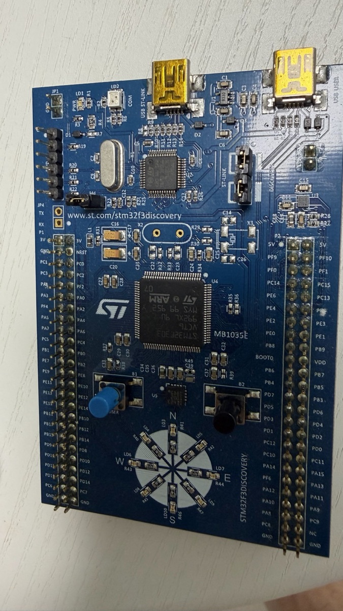
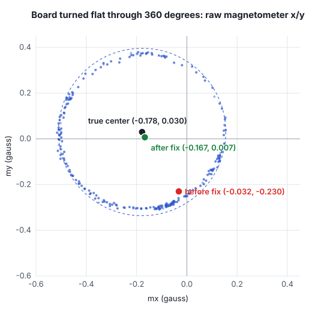

STM32F3 Discovery 보드에는 가속도 센서, 지자기 센서, 자이로 센서와 함께 LED 8개가 나침반 모양으로 둥글게 배치되어 있습니다. 이번 글에서는 이 보드로 **자북을 가리키는 LED가 켜지는 나침반**을 Zephyr RTOS로 만들었습니다. 보드를 기울여도 방향이 틀어지지 않도록 기울기 보정을 넣고, 버튼으로 시작하는 캘리브레이션 결과는 플래시에 저장합니다.

결과물 자체보다 **과정에서 만난 문제와 그 문제를 데이터로 확인하고 고친 방법**에 초점을 맞췄습니다. 실제 제품 개발에서도 시간을 가장 많이 쓰는 부분이 바로 이런 곳이기 때문입니다.



## 보드 리비전과 센서 확인

같은 STM32F3 Discovery라도 리비전에 따라 센서가 다릅니다. 예전 보드에는 LSM303DLHC와 L3GD20이, 최근 보드에는 LSM303AGR과 I3G4250D가 들어갑니다. 코드를 쓰기 전에 가지고 있는 보드부터 확인했습니다.

- 보드 앞면 실크: `MB1035E`
- 뒷면 라벨: `MB1035-F303C-E02`
- MCU: `STM32F303VCT6`

Zephyr는 이 차이를 **보드 리비전**으로 처리합니다. `boards/st/stm32f3_disco/board.yml`에 리비전 B(기본값)와 E가 정의되어 있고, E를 선택하면 `stm32f3_disco_stm32f303xc_E.overlay`가 적용되어 센서 노드가 바뀝니다.

```dts
&i2c1 {
	/delete-node/ lsm303dlhc-magn@1e;
	/delete-node/ lsm303dlhc-accel@19;

	lsm303agr_magn: lsm303agr-magn@1e {
		compatible = "st,lis2mdl", "st,lsm303agr-magn";
		reg = <0x1e>;
	};
	...
};
```

C 코드는 한 줄도 바꾸지 않고, 빌드할 때 `-b stm32f3_disco@E`만 지정하면 됩니다. 하드웨어 차이를 디바이스 트리에서 흡수하는 Zephyr 방식의 좋은 예입니다.

센서가 실제로 맞는지는 Zephyr의 `sensor_shell` 샘플로 확인했습니다. 세 드라이버 모두 초기화할 때 칩의 `WHO_AM_I` 레지스터를 읽어 기대값과 다르면 초기화를 실패시킵니다. 세 장치가 모두 `READY`였으므로 I3G4250D(0xD3), LSM303AGR 지자기(0x40), 가속도(0x33)가 맞다는 것을 확인할 수 있었습니다. Rev E 보드는 ST-LINK USB에 가상 COM 포트가 있어서 별도의 USB-UART 어댑터 없이 셸을 쓸 수 있습니다.

## 개발 환경 구축: 릴리스에 고정한 west 워크스페이스

데모 저장소는 누구나 같은 결과를 재현할 수 있어야 합니다. 그래서 저장소 자체를 west 매니페스트로 만들고 Zephyr 버전을 릴리스 태그에 고정했습니다. 이 보드에 필요한 모듈만 받도록 제한해서 전체 모듈(수 GB) 대신 약 1.7 GB만 내려받습니다.

```yaml
manifest:
  projects:
    - name: zephyr
      remote: zephyrproject-rtos
      revision: v4.4.2
      import:
        name-allowlist:
          - cmsis
          - cmsis_6
          - hal_st
          - hal_stm32
```

여기서 두 가지를 배웠습니다.

- **`hal_st`를 빼면 센서 드라이버가 조용히 빠집니다.** 처음에는 `hal_stm32`와 CMSIS만 넣었는데, 빌드는 성공하는데 지자기와 자이로 드라이버가 설정에서 사라졌습니다. 두 드라이버 모두 `depends on ZEPHYR_HAL_ST_MODULE`이기 때문입니다. 에러가 아니라 기능이 빠지는 방식이라, `.config`를 직접 확인하지 않으면 놓치기 쉽습니다.
- **보드의 기본 플래시 도구가 바뀌었습니다.** v4.4.2에서 이 보드의 기본 러너는 STM32CubeProgrammer입니다. OpenOCD를 쓰려고 앱의 `CMakeLists.txt`에서 기본값을 바꿨습니다.

```cmake
# Flash with OpenOCD; the board default is STM32CubeProgrammer.
set(BOARD_FLASH_RUNNER openocd)
```

툴체인은 Zephyr SDK 1.0.1입니다. Zephyr 4.4는 SDK 1.0 이상을 요구하므로, 예전 0.16.x SDK로는 빌드되지 않습니다.

## 센서 값 읽기, 그리고 Zephyr 드라이버 버그

`sensor_shell`로 센서를 읽어 보니 가속도와 지자기는 정상이었는데, **자이로의 X, Y, Z 값이 항상 똑같았습니다.**

```
gyro_xyz: (10.971557, 10.971557, 10.971557)
```

드라이버를 따라가 보니 원인은 SPI 읽기 방식이었습니다. I3G4250D는 여러 바이트를 한 번에 읽을 때 레지스터 주소의 bit 6(자동 증가)을 켜야 합니다. 2026년 1월에 이 드라이버가 ST 공용 SPI 헬퍼로 옮겨지면서, 자동 증가를 켜는 `STMEMSC_CTX_SPI_INCR` 대신 `STMEMSC_CTX_SPI`가 쓰였습니다. 그래서 `OUT_X_L`부터 6바이트를 읽으면 같은 레지스터를 여섯 번 읽게 되고, 세 축이 같은 값이 됩니다.

한 줄을 고친 뒤 upstream `main`에서도 같은 증상과 수정 효과를 보드로 확인했습니다.

```
수정 전: GYRO 53.-31664 53.-31664 53.-31664
수정 후: GYRO 0.004464 0.-21786 0.016966
```

이 내용은 Zephyr에 [이슈 #120318](https://github.com/zephyrproject-rtos/zephyr/issues/120318)과 [PR #120319](https://github.com/zephyrproject-rtos/zephyr/pull/120319)로 올렸습니다. v4.4.x 릴리스에도 있는 문제라 백포트 대상입니다. (출력의 음수 소수부는 같은 드라이버의 변환 함수에 있는 별도 문제로, 다음 PR로 다룰 예정입니다.) 나침반에는 자이로가 필요 없어서 이번 작업에는 영향이 없었습니다.

## 센서 축과 보드 축 맞추기

방위를 계산하려면 센서 칩의 X/Y/Z가 보드의 어느 방향인지 알아야 합니다. 데이터시트 그림만 믿지 않고 측정으로 정했습니다. 보드 좌표계는 x = N 가장자리(USB 커넥터 쪽), y = E 가장자리, z = 아래 방향으로 두었습니다.

**가속도 센서**는 보드를 기울여 가며 정했습니다.

| 자세 | 결과 | 보드 축 |
|---|---|---|
| 평평하게 놓기 | 칩 z = +9.48 m/s² | 보드 z = −칩 z |
| N 가장자리 들기 | 칩 y가 크게 증가 | 보드 x = +칩 y |
| E 가장자리 들기 | 칩 x가 크게 감소 | 보드 y = −칩 x |

흥미롭게도 이 결과를 그대로 합치면 **거울상(왼손 좌표계)** 이 됩니다. 실제 칩은 회전만 할 뿐 뒤집힐 수 없으므로, 드라이버나 칩의 부호 규약 중 하나가 데이터시트 그림과 다르다는 뜻입니다. 두 번씩 반복해도 같은 결과여서, 매핑은 측정값을 그대로 따랐습니다. 각 규칙이 보드 축 하나를 측정값으로 직접 정하기 때문에 칩 쪽 규약과 상관없이 결과는 맞습니다.

**지자기 센서**는 조금 더 조심해야 했습니다. 캘리브레이션 전의 지자기 값에는 보드 자체의 자기(hard-iron 오프셋)가 섞여 있어서, 한 자세의 값만 보고 부호를 정하면 틀릴 수 있습니다. 그래서 **반대 자세의 차이**를 썼습니다. 북쪽을 볼 때와 남쪽을 볼 때의 차이에서는 오프셋이 지워지고 지구 자기장만 남습니다.

- 북 − 남: 칩 y가 +0.62 G 변화 → 보드 x = +칩 y
- 서 − 동: 칩 x가 −0.58 G 변화 → 보드 y = −칩 x

z축은 책상 위에서 자기장의 수직 성분이 유난히 작아서 뒤집기 실험으로는 부호가 분명하지 않았습니다. 대신 **복각(중력과 자기장 사이의 각도)은 보드를 어떻게 돌려도 일정해야 한다**는 성질을 이용했습니다. 보드를 20초 동안 이리저리 돌린 데이터로 두 부호 후보를 비교하니, 올바른 부호에서는 복각의 표준편차가 7.4°, 반대 부호에서는 22.4°였습니다. 결과적으로 지자기 축도 가속도 축과 똑같이 매핑됩니다.

```c
/* Board axis n = sign * chip axis src. */
static const struct axis_map accel_map[3] = {{1, 1}, {0, -1}, {2, -1}};
static const struct axis_map magn_map[3] = {{1, 1}, {0, -1}, {2, -1}};
```

참고로 이 책상에서 측정한 복각은 약 12°였습니다. 한국의 실외 복각은 50°대이므로, 실내의 철근이나 가구가 자기장을 꽤 휘게 만든다는 것을 알 수 있습니다.

## 방위각 계산과 기울기 보정

기울기 보정은 가속도 센서로 중력 방향을 구해 롤과 피치를 계산하고, 지자기 벡터를 수평면으로 되돌린 뒤 방위각을 구하는 방식입니다.

```c
roll = atan2f(gy, gz);
pitch = atan2f(-gx, sqrtf(gy * gy + gz * gz));

/* Rotate the magnetic field back to the horizontal plane. */
xh = magn->x * cosf(pitch) + magn->y * sinf(roll) * sinf(pitch) +
     magn->z * cosf(roll) * sinf(pitch);
yh = magn->y * cosf(roll) - magn->z * sinf(roll);

heading = atan2f(-yh, xh) * RAD_TO_DEG;
```

이 계산은 Zephyr 헤더를 쓰지 않는 순수 C 모듈(`lib/compass`)로 분리했습니다. 처음에는 Zephyr의 `unit_testing` 플랫폼으로 테스트하려 했지만, macOS에서는 ELF 섹션 속성 때문에 빌드되지 않았습니다. 그래서 CMake/CTest로 호스트에서 바로 도는 테스트를 만들고, 테스트를 먼저 쓰는 방식(TDD)으로 구현했습니다. 테스트는 알려진 자세(방위, 피치, 롤)로 중력과 자기장 벡터를 회전시켜 입력을 만들고, 계산된 방위각이 원래 방위와 맞는지 확인합니다. 구현 전에 Python으로 ±60° 기울기의 무작위 자세 2만 개에 대해 공식을 확인했을 때 최대 오차는 사실상 0이었습니다.

그 외에 지수 이동 평균으로 값을 부드럽게 하고, LED 경계(22.5°)에 5°의 히스테리시스를 둬서 경계 근처에서 LED가 깜빡거리지 않게 했습니다. GitHub Actions에서 호스트 테스트와 펌웨어 빌드를 매 푸시마다 실행합니다.

## Hard-iron 캘리브레이션: 버그를 데이터로 찾기

캘리브레이션은 USER 버튼을 누르고 15초 동안 보드를 돌리면서 지자기 각 축의 최솟값과 최댓값을 모으고, 그 중간값을 오프셋으로 저장하는 가장 단순한 방식입니다. 결과는 Zephyr settings(NVS)로 플래시의 6 KB `storage` 영역에 저장해서 리셋 후에도 유지됩니다.

처음 구현했을 때 캘리브레이션은 성공으로 나왔는데 나침반이 틀렸습니다. 보드를 북, 동, 남, 서로 돌려 가며 기록한 방위각은 이랬습니다.

| 보드 방향 | 기대값 | 측정값 |
|---|---|---|
| 북 | 0° | 300° |
| 동 | 90° | 151° |
| 남 | 180° | 204° |
| 서 | 270° | 254° |

보드를 한 바퀴 돌려도 방위각이 150°~300° 사이에서만 움직였습니다. 남은 오프셋이 지구 자기장만큼 커서, 센서가 주로 오프셋을 보고 있다는 신호입니다.

원인을 찾기 위해 원시 데이터를 기록했습니다. 보드를 평평하게 한 바퀴 돌리면 지자기의 x, y 값은 원을 그리고, 그 **원의 중심이 진짜 오프셋**입니다. 원에 맞춰 보니 중심은 (−0.178, 0.030) G였는데, 저장된 캘리브레이션은 (−0.032, −0.230) G로 0.3 G 가까이 틀려 있었습니다.



캘리브레이션 중의 원시 데이터를 다시 기록하자 원인이 보였습니다. 튀는 값이 아니라, **x축과 y축이 극값에 도달하지 못한 것**이었습니다.

| 축 | 캘리브레이션 중 범위 | 실제 범위 |
|---|---|---|
| x | 0.34 G | 약 0.67~0.88 G |
| y | 0.24 G | 약 0.69~0.85 G |
| z | 0.53 G | 비슷함 |

이 책상의 자기장은 거의 수평이라, x축과 y축의 극값을 얻으려면 보드의 가장자리가 북쪽과 남쪽을 향하도록 **평평하게 돌려야** 합니다. 보드를 뒤집고 세우기만 해서는 부족했습니다. 그런데 기존 검증은 "각 축의 범위가 0.2 G 이상"만 확인했기 때문에 이런 불완전한 결과도 통과했습니다.

그래서 **각 축의 범위가 가장 큰 축 범위의 70% 이상**이어야 한다는 조건을 추가했습니다. 완전히 돌리면 모든 축의 범위가 자기장 세기의 약 두 배로 비슷해지기 때문입니다. 테스트에는 보드에서 실제로 측정한 두 경우를 그대로 넣었습니다.

```c
static void test_cal_unbalanced_spans_are_rejected(void)
{
	/* Measured on the board: no full horizontal turn, spans 0.34/0.24/0.53. */
	check_cal_extremes(v(-0.194f, -0.141f, 0.057f), v(0.141f, 0.096f, 0.582f),
			   COMPASS_ERR_UNBALANCED);
}

static void test_cal_balanced_spans_are_accepted(void)
{
	/* Measured on the board: full tumble, spans 0.88/0.85/0.67. */
	check_cal_extremes(v(-0.452f, -0.591f, -0.625f), v(0.432f, 0.254f, 0.048f), COMPASS_OK);
}
```

캘리브레이션 안내 문구도 "먼저 평평하게 한 바퀴 돌린 뒤 뒤집고 기울이기"로 바꿨습니다. 수정 후 캘리브레이션의 축 범위는 0.70/0.73/0.71 G로 고르게 나왔고, 오프셋은 (−0.167, 0.007) G로 원 중심과 0.023 G 이내로 일치했습니다.

실험 중 알게 된 작은 점도 있습니다. 보드를 테이블에 엎어 놓으면 위쪽의 버튼이 눌려서 캘리브레이션이 취소되거나 보드가 리셋됩니다. 캘리브레이션은 보드를 손에 든 채로 해야 합니다.

## 결과

같은 네 방향 테스트를 수정 후에 다시 했습니다.

| 보드 방향 | 측정값 | 오차 | 이전 방향과의 차이 |
|---|---|---|---|
| 북 | 338° | −22° | — |
| 동 | 62° | −28° | 84° |
| 남 | 159° | −21° | 97° |
| 서 | 246° | −24° | 87° |

90° 회전이 84°~97°로 측정되어 회전은 정확하게 따라갑니다. 남은 오차는 모든 방향에서 약 −23° ± 3°로 거의 일정합니다. 일정한 오차는 보드 자체의 자기가 아니라 책상 주변의 자기장이 자북에서 틀어져 있거나 기준선이 어긋났을 때 나타나는 형태입니다. 실외에서 다시 측정해서 확인할 예정입니다.

기울기 보정도 확인했습니다. 북쪽을 향한 채 E 쪽을 약 30° 들면 +8°, N 쪽을 들면 +4°만 변했고, 켜진 LED는 그대로였습니다. 펌웨어 크기는 플래시 68 KB, RAM 9 KB입니다.

## 다음 단계

- 실외에서 네 방향 테스트를 다시 해서 −23° 오차의 원인 확인
- 로직 애널라이저로 I2C 버스 파형 측정
- 이 보드에 MCUboot를 올려 서명된 펌웨어 업데이트 적용 (다음 글)
- I3G4250D 드라이버의 값 변환 문제 업스트림 수정

펌웨어와 호스트 테스트, 설계 문서는 GitHub 저장소에 있습니다. 비슷한 센서 통합이나 Zephyr 기반 펌웨어 개발이 필요하시면 언제든 연락 주세요.
